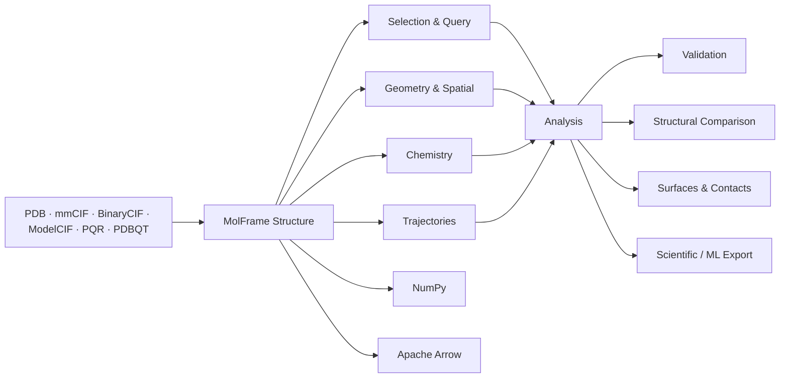

<div align="center">

# MolFrame

**High-performance structural bioinformatics for Python and Rust.**

Read, transform, analyze, and compare molecular structures through a single semantics-preserving data model.

[](#license)
[](https://www.rust-lang.org/)
[](https://www.python.org/)

</div>

---

MolFrame is a structural bioinformatics engine for macromolecular structures, trajectories, and derived scientific data.

It combines high-performance Rust kernels with native Python bindings and a columnar molecular representation shared across **I/O, selection, geometry, chemistry, surfaces, validation, structural comparison, trajectories, and machine-learning workflows**.

The guiding principle is simple:

> **Structural data is more than coordinates.**

Alternate conformations, biological assemblies, insertion codes, identifier namespaces, missing atoms, and provenance can all change the interpretation of a result. MolFrame is designed to preserve that context throughout the analysis pipeline.

## Why MolFrame?

Structural workflows often combine parsers, hierarchy libraries, array representations, trajectory packages, and specialized analysis tools.

Each conversion introduces another data model — and another opportunity to lose structural meaning.

MolFrame keeps the workflow inside one representation.

- **One structural model** — parse, query, analyze, compare, and export without translating between unrelated representations.
- **Semantics-preserving I/O** — retain alternate locations, insertion codes, author and label identifiers, assemblies, and format-specific information.
- **Native performance** — core parsing and analysis kernels are implemented in Rust with parallel and vectorized execution where appropriate.
- **Zero-copy interoperability** — expose coordinates directly to NumPy and columnar annotations through Apache Arrow.
- **Explicit scientific context** — analysis APIs can carry ambiguity, coverage, diagnostics, policy, and provenance instead of hiding important decisions behind defaults.
- **Python and Rust** — native interfaces over the same computational engine.
- **Modular Rust API** — use the complete engine or compile only the format and analysis domains an application requires.

## Installation

### Python

```bash
pip install molframe
```

```python
import molframe
```

### Rust

```bash
cargo add molframe
```

```rust
use molframe::prelude::*;
```

> MolFrame is currently pre-1.0. Public APIs may evolve while the core contracts are finalized.

## Quick start

### Python

```python
import molframe

structure = molframe.read("1ubq.cif")

print(structure.atom_count)
print(structure.chain_count)

xyz = structure.xyz
print(xyz.shape)
```

`structure.xyz` exposes coordinates as an `N × 3` `float32` NumPy-compatible view without rebuilding the molecular structure in Python.

The same structure can be used directly for querying and analysis:

```python
structure = molframe.read("1ubq.cif")

for chain in structure.chains:
    print(chain.label, len(chain.residues))
```

### Rust

```rust
use molframe::prelude::*;

fn main() -> Result<(), Box<dyn std::error::Error>> {
    let (structure, diagnostics) =
        molframe::read_with_diagnostics("1ubq.cif")?;

    println!(
        "{} atoms in {} chains",
        structure.atom_count(),
        structure.chain_count()
    );

    for diagnostic in diagnostics {
        eprintln!("{diagnostic}");
    }

    Ok(())
}
```

`read_with_diagnostics` preserves problems and ambiguities encountered while loading a structure instead of reducing parsing to a success/failure decision.

## One model from file to result



All of these operations share the same underlying structural representation.

Formats are inputs and outputs. The model between them is the core of MolFrame.

## Capabilities

| Area | Capabilities |
| --- | --- |
| **Structure I/O** | PDBx/mmCIF, BinaryCIF, ModelCIF, legacy PDB, PQR, PDBQT |
| **Structural model** | Atoms, residues, chains, models, identifiers, alternate conformations, assemblies |
| **Query** | Structural selections and reusable queries |
| **Geometry** | Distances, angles, transforms, alignment, internal coordinates |
| **Spatial analysis** | Neighbor search, contacts, spatial indexing |
| **Chemistry** | Element- and residue-aware structural chemistry |
| **Crystallography** | Symmetry and biological assembly operations |
| **Surfaces** | Molecular and solvent-related surface analysis |
| **Validation** | Structural diagnostics and consistency checks |
| **Comparison** | Alignment, RMSD, structural comparison |
| **Trajectories** | Frame-oriented molecular trajectory analysis |
| **Machine learning** | Structured scientific and ML-oriented export |
| **Interoperability** | NumPy, Apache Arrow, native Rust |
| **Interfaces** | Rust, Python, command line |

## Structural semantics

A molecular structure contains information that is easy to erase accidentally.

Consider an atom belonging to a residue with:

- an author-assigned residue number;
- a separate canonical identifier;
- an insertion code;
- multiple alternate conformations;
- partial occupancy;
- coordinates from one model;
- biological assembly context.

Reducing that structure prematurely to:

```text
x, y, z, element
```

can preserve its geometry while losing the information required to interpret it correctly.

MolFrame keeps structural context alongside coordinates:

```text
Structure
├── coordinates
├── model
├── chain
├── residue
├── atom
├── altloc
├── occupancy
├── identifiers
├── assembly context
└── provenance
```

Selections and analyses therefore operate on a representation that still understands what the coordinates mean.

## Explicit scientific results

Many structural analyses depend on choices that are often implicit:

- Which model should be analyzed?
- Which biological assembly?
- Which alternate conformer?
- Which identifier namespace?
- What should happen when atoms are missing?
- How much of the requested structure was actually analyzable?

MolFrame's analysis architecture is designed to make such decisions inspectable.

An enriched analysis result can conceptually carry:

```text
Analysis<T>
├── value
├── coverage
├── ambiguity
├── diagnostics
└── provenance
```

This allows the value and the conditions under which it was produced to travel together.

An analysis may also be **indeterminate** when the available structure does not support a scientifically defensible result.

Producing no answer is preferable to silently producing a misleading one.

## Columnar by construction

MolFrame stores molecular information in a column-oriented representation rather than building the primary data model from individually allocated atom and residue objects.

This supports:

- contiguous coordinate storage;
- efficient scans and selections;
- compact identifiers;
- chunk-level statistics;
- parallel kernels;
- SIMD-friendly numeric operations;
- direct NumPy views;
- Arrow interoperability;
- efficient serialization and transfer.

Hierarchical access remains available as a view over the same structure:

```python
for chain in structure.chains:
    for residue in chain.residues:
        print(chain.label, residue.name)
```

The hierarchy is an interface over the molecular data, not a second independent copy of it.

## File formats

### PDBx/mmCIF

mmCIF is treated as a first-class structural format rather than immediately reduced to a legacy PDB-shaped schema.

MolFrame's CIF infrastructure is designed to preserve categories beyond the core atomic structure, including extension data that should survive round trips.

### BinaryCIF

BinaryCIF provides compact binary encoding for PDBx data and maps into the same structural representation.

### Legacy PDB

Legacy fixed-column PDB remains widely used and is supported directly.

Writers treat format limits explicitly. Data that cannot be safely represented should produce an error rather than silently truncating scientifically meaningful fields.

### ModelCIF, PQR, and PDBQT

Specialized structure formats enter the same model so downstream algorithms do not require separate representations for each source.

## Zero-copy Python interoperability

The Python API is a native interface to the Rust engine rather than a reimplementation of its computational kernels.

```python
structure = molframe.read("1ubq.cif")

xyz = structure.xyz
```

Coordinate buffers can be exposed directly to NumPy-compatible code.

Columnar annotations can be represented through Apache Arrow, enabling efficient exchange with scientific and analytical Python tools without reconstructing a hierarchy of Python objects.

MolFrame is designed to integrate with the Python scientific ecosystem rather than replace it.

## Query and selection

Selections are part of the computational model rather than string filters bolted onto individual algorithms.

A selection can describe structural concepts such as:

```text
polymer
ligand
water
chain
residue range
element
spatial neighborhood
arbitrary predicate
```

The same selection semantics can then be reused across compatible analyses.

This prevents each algorithm from inventing its own interpretation of what constitutes the selected structure.

## Geometry and spatial analysis

MolFrame provides reusable kernels for common structural operations including:

- distances;
- angles and dihedrals;
- coordinate transforms;
- centroids and extents;
- radius of gyration;
- structural alignment;
- internal coordinates;
- spatial indexing;
- neighbor queries;
- contact analysis.

Numeric kernels operate directly over the underlying coordinate representation whenever possible.

## Structural comparison

Comparison workflows use the same molecular identifiers and structure model as ordinary analysis.

This supports operations such as:

```text
mapping
alignment
superposition
RMSD
local comparison
sequence-aware correspondence
```

without first converting structures into an unrelated comparison-specific representation.

## Validation

Parsing answers:

> Can this file be interpreted?

Validation asks:

> Does the interpreted structure make sense?

MolFrame separates these concerns.

Validation can report structural inconsistencies, suspicious geometry, incomplete data, representation problems, and other findings without conflating them with parser failure.

Diagnostics remain machine-readable so applications can decide how to handle them.

## Trajectories

Trajectory support extends the structural model across coordinate frames without redefining molecular identity at every timestep.

This enables analyses over:

```text
frame sequences
coordinate evolution
time-dependent measurements
structural comparison
aggregated trajectory statistics
```

while keeping topology and coordinate data appropriately separated.

## Command line

Common operations are also available from the command line:

```bash
molframe info 1ubq.cif

molframe convert input.pdb output.cif

molframe validate structure.cif

molframe measure structure.cif

molframe rmsd model-a.cif model-b.cif
```

The CLI uses the same parsing and computational engine as the library APIs.

## Performance

Performance claims should be reproducible.

MolFrame includes benchmark infrastructure for:

- parsing;
- structural access;
- selections;
- geometry;
- spatial operations;
- analysis;
- serialization;
- Python-boundary operations.

The architecture emphasizes properties that scale well:

```text
contiguous data
low allocation pressure
parallel execution
SIMD-friendly kernels
zero-copy boundaries
memory mapping where appropriate
feature-gated dependencies
```

Specific benchmark numbers belong with their dataset, hardware, software revision, and methodology rather than as context-free claims in this README.

See [`benchmarks/`](benchmarks/) for benchmark sources and methodology.

## Rust features

The Rust facade is modular.

Applications can enable only the domains they require.

Feature areas include:

```text
mmcif
bcif
modelcif
pdb

geom
query
spatial
chem
xtal

surface
analysis
validate
compare
traj
ml
```

The default configuration exposes the complete engine, while advanced consumers can build against a smaller dependency surface.

## Project status

MolFrame is under active development and has not reached 1.0.

The project distinguishes three different properties:

**Implemented**  
The capability exists.

**Validated**  
The behavior has the appropriate deterministic, golden, differential, or scientific evidence.

**Stable**  
The public contract is expected to remain backwards compatible.

A feature being implemented does not automatically imply that it has reached the other two stages.

Pre-1.0 releases may contain breaking API changes while these contracts are finalized.

## Development

Build the complete Rust workspace:

```bash
cargo build --workspace
```

Run the test suite:

```bash
cargo test --workspace
```

The repository also contains project-specific verification tooling for formatting, linting, packaging, bindings, scientific fixtures, and reproducibility checks.

See [`CONTRIBUTING.md`](CONTRIBUTING.md) for the development workflow.

## Citation

If MolFrame contributes to published research, please cite the software.

Machine-readable citation metadata is provided in [`CITATION.cff`](CITATION.cff).

## License

MolFrame is dual-licensed under either:

- [MIT License](LICENSES/MIT.txt), or
- [Apache License 2.0](LICENSES/Apache-2.0.txt),

at your option.
