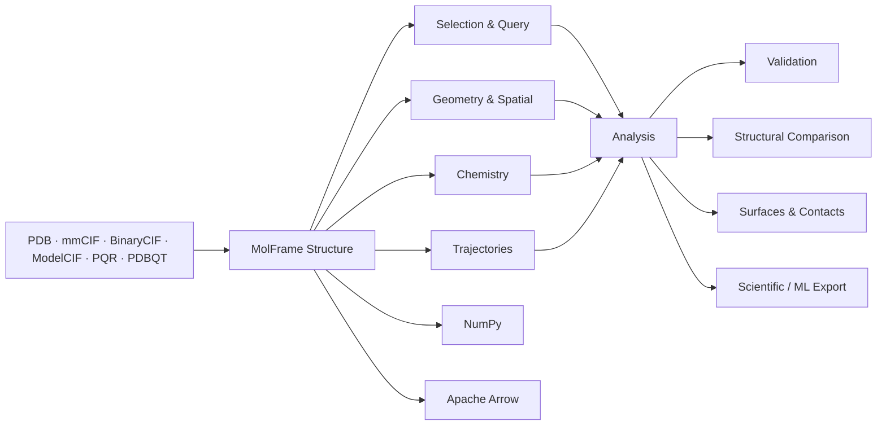

<div align="center">

# MolFrame
[Documentation](https://miguelcsx.github.io/molframe/) · [GitHub](https://github.com/miguelcsx/molframe)
**High-performance structural bioinformatics for Python and Rust.**

Read, transform, analyze, and compare molecular structures through a single semantics-preserving data model.

[](#license)
[](https://www.rust-lang.org/)
[](https://www.python.org/)

</div>

---

MolFrame is a structural bioinformatics engine for macromolecular structures, trajectories, and derived scientific data.

It combines high-performance Rust kernels with native Python bindings and a columnar molecular representation shared across **I/O, selection, geometry, chemistry, surfaces, validation, structural comparison, trajectories, and machine-learning workflows**.

The guiding principle is simple:

> **Structural data is more than coordinates.**

Alternate conformations, biological assemblies, insertion codes, identifier namespaces, missing atoms, and provenance can all change the interpretation of a result. MolFrame is designed to preserve that context throughout the analysis pipeline.

## Why MolFrame?

Structural workflows often combine parsers, hierarchy libraries, array representations, trajectory packages, and specialized analysis tools.

Each conversion introduces another data model — and another opportunity to lose structural meaning.

MolFrame keeps the workflow inside one representation.

- **One structural model** — parse, query, analyze, compare, and export without translating between unrelated representations.
- **Semantics-preserving I/O** — retain alternate locations, insertion codes, author and label identifiers, assemblies, and format-specific information.
- **Native performance** — core parsing and analysis kernels are implemented in Rust with parallel and vectorized execution where appropriate.
- **Zero-copy interoperability** — expose coordinates directly to NumPy and columnar annotations through Apache Arrow.
- **Explicit scientific context** — analysis APIs can carry ambiguity, coverage, diagnostics, policy, and provenance instead of hiding important decisions behind defaults.
- **Python and Rust** — native interfaces over the same computational engine.
- **Modular Rust API** — use the complete engine or compile only the format and analysis domains an application requires.

## Installation

### Python

```bash
pip install molframe
```

```python
import molframe
```

### Rust

```bash
cargo add molframe
```

```rust
use molframe::prelude::*;
```

> MolFrame is currently pre-1.0. Public APIs may evolve while the core contracts are finalized.

## Quick start

### Python

```python
import molframe

structure = molframe.read("1ubq.cif")

print(structure.atom_count)
print(structure.chain_count)

coordinates = structure.coordinates
print(coordinates.shape)
```

`structure.coordinates` exposes coordinates as an `N × 3` read-only `float32`
NumPy view without rebuilding the molecular structure in Python. A
`Selection.to_coordinates()` call is intentionally named because a discontiguous
selection must be materialized.

The same structure can be used directly for querying and analysis:

```python
structure = molframe.read("1ubq.cif")

backbone = structure.select("name CA")
print(backbone.to_coordinates().shape)
```

### Rust

```rust
use molframe::prelude::*;

fn main() -> Result<(), Box<dyn std::error::Error>> {
    let (structure, diagnostics) =
        molframe::read_with_diagnostics("1ubq.cif")?;

    println!(
        "{} atoms in {} chains",
        structure.atom_count(),
        structure.chain_count()
    );

    for diagnostic in diagnostics {
        eprintln!("{diagnostic}");
    }

    Ok(())
}
```

`read_with_diagnostics` preserves problems and ambiguities encountered while loading a structure instead of reducing parsing to a success/failure decision.

`molframe read` parses a path, bytes, or reader; it does not turn an identifier into a guessed network URL. Use the CLI verified acquisition boundary when retrieving an external resource:

```bash
molframe fetch 1HHO --url-template 'https://example.org/structures/{id}.cif' --sha256 <64-hex-digest> --max-bytes 50000000 --timeout-seconds 30 --redirect-limit 0 --output 1HHO.cif
```

The URL must contain `{id}`. The fetch command enforces the byte limit, timeout, redirect policy, and SHA-256 digest before atomically creating the destination; existing files are not replaced. A digest proves that the bytes match the expected value, not who published them, so retain the HTTPS origin and provider/version metadata. CCD downloads use `molframe ccd update` with the same verification controls and require `--replace` for replacement. The Python API intentionally keeps acquisition separate from parsing.


## Workflow and data-movement contract

`Workflow` builds an immutable typed DAG with named inputs and outputs. Compile
once, then reuse the `CompiledWorkflow`; compilation validates types and cycles,
removes dead and common nodes, fixes deterministic execution order, plans value
lifetimes, and estimates peak retained memory. Kernels keep their bounded
internal parallelism while graph nodes run in stable topological order.

Logical and physical explanations label movement explicitly: `Borrow` aliases a
live input, `Adopt` retains an owner without copying its payload, `Decode`
converts encoded data, `Copy` duplicates native storage, and `Materialize`
computes or gathers a new representation. Python follows the same rule:
compatible contiguous arrays are borrowed for eager calls, non-contiguous arrays
are rejected with an instruction to use `numpy.ascontiguousarray`, and values
retained by a compiled workflow require the explicit `copy=True` choice.

Potentially large interaction results are native structure-of-arrays tables.
Their columns are borrowed directly in Rust, reducer blocks append column by
column, and Python arrays retain native owners. A `Selection` is structure-bound
and zero-copy; `Selection.to_coordinates()` is the explicit gather operation.

## One model from file to result


```mermaid
flowchart LR
    Input["PDB · mmCIF · BinaryCIF · ModelCIF · PQR · PDBQT"]

    Input --> Structure["MolFrame Structure"]

    Structure --> Query["Selection & Query"]
    Structure --> Geometry["Geometry & Spatial"]
    Structure --> Chemistry["Chemistry"]
    Structure --> Trajectory["Trajectories"]

    Query --> Analysis["Analysis"]
    Geometry --> Analysis
    Chemistry --> Analysis
    Trajectory --> Analysis

    Analysis --> Validation["Validation"]
    Analysis --> Compare["Structural Comparison"]
    Analysis --> Surface["Surfaces & Contacts"]
    Analysis --> ML["Scientific / ML Export"]

    Structure --> NumPy["NumPy"]
    Structure --> Arrow["Apache Arrow"]
```

All of these operations share the same underlying structural representation.

Formats are inputs and outputs. The model between them is the core of MolFrame.

## Capabilities

| Area | Capabilities |
| --- | --- |
| **Structure I/O** | PDBx/mmCIF, BinaryCIF, ModelCIF, legacy PDB, PQR, PDBQT |
| **Structural model** | Atoms, residues, chains, models, identifiers, alternate conformations, assemblies |
| **Query** | Structural selections and reusable queries |
| **Geometry** | Distances, angles, transforms, alignment, internal coordinates |
| **Spatial analysis** | Neighbor search, contacts, spatial indexing |
| **Chemistry** | Element- and residue-aware structural chemistry |
| **Crystallography** | Symmetry and biological assembly operations |
| **Surfaces** | Molecular and solvent-related surface analysis |
| **Validation** | Structural diagnostics and consistency checks |
| **Comparison** | Alignment, RMSD, structural comparison |
| **Trajectories** | Frame-oriented molecular trajectory analysis |
| **Machine learning** | Structured scientific and ML-oriented export |
| **Interoperability** | NumPy, Apache Arrow, native Rust |
| **Interfaces** | Rust, Python, command line |

## Structural semantics

A molecular structure contains information that is easy to erase accidentally.

Consider an atom belonging to a residue with:

- an author-assigned residue number;
- a separate canonical identifier;
- an insertion code;
- multiple alternate conformations;
- partial occupancy;
- coordinates from one model;
- biological assembly context.

Reducing that structure prematurely to:

```text
x, y, z, element
```

can preserve its geometry while losing the information required to interpret it correctly.

MolFrame keeps structural context alongside coordinates:

```text
Structure
├── coordinates
├── model
├── chain
├── residue
├── atom
├── altloc
├── occupancy
├── identifiers
├── assembly context
└── provenance
```

Selections and analyses therefore operate on a representation that still understands what the coordinates mean.

## Explicit scientific results

Many structural analyses depend on choices that are often implicit:

- Which model should be analyzed?
- Which biological assembly?
- Which alternate conformer?
- Which identifier namespace?
- What should happen when atoms are missing?
- How much of the requested structure was actually analyzable?

MolFrame's analysis architecture is designed to make such decisions inspectable.

An enriched analysis result can conceptually carry:

```text
Analysis<T>
├── value
├── coverage
├── ambiguity
├── diagnostics
└── provenance
```

This allows the value and the conditions under which it was produced to travel together.

In Python this is `molframe.Analysis`, returned by the governed analyses, and the
decisions are an `AnalysisPolicy` you pass in:

```python
import molframe

structure = molframe.read("1abc.pdb")
policy = molframe.AnalysisPolicy(altloc="highest_occupancy_per_residue", identifiers="label")

result = molframe.analysis.contacts(structure, 4.5, policy=policy)
result.status        # "complete" | "partial" | "ambiguous" | "indeterminate"
result.coverage      # used / intended atoms, missing, ambiguous
result.assumptions   # decisions made on your behalf
result.provenance    # deterministic JSON: version, policy, parameters
result.value         # the ContactTable

structure.select("chain B", policy=policy)  # the same policy decides what "chain" means
```

`contacts`, `hydrogen_bonds`, `salt_bridges`, `validation.clashes` and
`trajectory.rmsd` return an `Analysis`; the hydrogen-bond and salt-bridge
analyses need charges and roles from a Chemical Component Dictionary, supplied
with `molframe.chemistry.annotate(structure, "components.cif")`, and say so when
they are missing.

An analysis may also be **indeterminate** when the available structure does not support a scientifically defensible result.

Producing no answer is preferable to silently producing a misleading one.

## Columnar by construction

MolFrame stores molecular information in a column-oriented representation rather than building the primary data model from individually allocated atom and residue objects.

This supports:

- contiguous coordinate storage;
- efficient scans and selections;
- compact identifiers;
- chunk-level statistics;
- parallel kernels;
- SIMD-friendly numeric operations;
- direct NumPy views;
- Arrow interoperability;
- efficient serialization and transfer.

Hierarchical access remains available as a view over the same structure:

```python
for chain in structure.chains:
    for residue in chain.residues:
        print(chain.label, residue.name)
```

The hierarchy is an interface over the molecular data, not a second independent copy of it.

## File formats

### PDBx/mmCIF

mmCIF is treated as a first-class structural format rather than immediately reduced to a legacy PDB-shaped schema.

MolFrame's CIF infrastructure is designed to preserve categories beyond the core atomic structure, including extension data that should survive round trips.

### BinaryCIF

BinaryCIF provides compact binary encoding for PDBx data and maps into the same structural representation.

### Legacy PDB

Legacy fixed-column PDB remains widely used and is supported directly.

Writers treat format limits explicitly. Data that cannot be safely represented should produce an error rather than silently truncating scientifically meaningful fields.

### ModelCIF, PQR, and PDBQT

Specialized structure formats enter the same model so downstream algorithms do not require separate representations for each source.

## Zero-copy Python interoperability

The Python API is a native interface to the Rust engine rather than a reimplementation of its computational kernels.

```python
structure = molframe.read("1ubq.cif")

xyz = structure.coordinates
```

Coordinate buffers can be exposed directly to NumPy-compatible code.

Columnar annotations can be represented through Apache Arrow, enabling efficient exchange with scientific and analytical Python tools without reconstructing a hierarchy of Python objects.

MolFrame is designed to integrate with the Python scientific ecosystem rather than replace it.

## Query and selection

A query is a short sentence that picks atoms: `resname HEM`, `protein and
chain A`, `byres (within 5 of resname HEM) and protein`. The complete language,
with every keyword, column and operator, is in the
**[query language reference](https://miguelcsx.github.io/molframe/docs/query-language/)**.

```python
import molframe

structure = molframe.read("4hhb.cif")

heme = structure.select("resname HEM")         # 172 atoms
len(heme), heme.indices, heme.to_coordinates()

pocket = molframe.Query("byres (within 5 of resname HEM) and protein")
structure.select(pocket)                       # compile once, run many times
```

```rust
use molframe::{AnalysisPolicy, Query, QueryStructure};

let query = Query::compile("byres (within 5 of resname HEM) and protein")?;
let evaluation = structure.select_query(&query, &AnalysisPolicy::default())?;
```

| You want | Write |
|---|---|
| A kind of molecule | `protein`, `nucleic`, `water`, `ligand`, `polymer` |
| Residues, chains, atoms | `resname HIS HEM`, `chain A B`, `name CA`, `element Fe` |
| Residue numbers | `resid 87`, `resid 1:10` |
| Wildcards | `name C*`, `resname H?S` |
| A numeric condition | `bfactor > 50`, `occupancy < 1` |
| Logic | `protein and not chain A`, `(chain A or chain C) and resid 1:5` |
| Distance | `within 5 of resname HEM`, `around 5 resname HEM` |
| Whole residues | `byres (within 5 of resname HEM)` |

A query that cannot run raises `molframe.QueryError`, which quotes the query,
underlines the problem and says what to do. A query that runs but probably
does not mean what it says (such as `and` and `or` mixed without parentheses)
warns with `molframe.QueryWarning`.

### Named queries

`$name` refers to another query, defined with `QueryAliases`. Resolving
substitutes every name, so what runs is an ordinary query:

```python
aliases = molframe.QueryAliases()
aliases.define("heme", molframe.Query("resname HEM"))
aliases.define("pocket", molframe.Query("byres (within 5 of $heme) and protein"))
structure.select(aliases.resolve(molframe.Query("$pocket")))
```

Definitions are live: redefining `heme` changes what `$pocket` resolves to.
Text and the typed builder (`molframe.sel.protein() & molframe.sel.chain("A")`)
compile to the same plan, whose `fingerprint` is its identity.

## Geometry and spatial analysis

MolFrame provides reusable kernels for common structural operations including:

- distances;
- angles and dihedrals;
- coordinate transforms;
- centroids and extents;
- radius of gyration;
- structural alignment;
- internal coordinates;
- spatial indexing;
- neighbor queries;
- contact analysis.

Numeric kernels operate directly over the underlying coordinate representation whenever possible.

## Structural comparison

Comparison workflows use the same molecular identifiers and structure model as ordinary analysis.

This supports operations such as:

```text
mapping
alignment
superposition
RMSD
local comparison
sequence-aware correspondence
```

without first converting structures into an unrelated comparison-specific representation.

## Validation

Parsing answers:

> Can this file be interpreted?

Validation asks:

> Does the interpreted structure make sense?

MolFrame separates these concerns.

Validation can report structural inconsistencies, suspicious geometry, incomplete data, representation problems, and other findings without conflating them with parser failure.

Diagnostics remain machine-readable so applications can decide how to handle them.

## Trajectories

Trajectory support extends the structural model across coordinate frames without redefining molecular identity at every timestep.

This enables analyses over:

```text
frame sequences
coordinate evolution
time-dependent measurements
structural comparison
aggregated trajectory statistics
```

while keeping topology and coordinate data appropriately separated.

## Command line

Common operations are also available from the command line:

```bash
molframe info 1ubq.cif

molframe convert input.pdb output.cif

molframe validate structure.cif

molframe measure structure.cif

molframe rmsd model-a.cif model-b.cif
```

The CLI uses the same parsing and computational engine as the library APIs.

## Performance

Performance claims should be reproducible.

MolFrame includes benchmark infrastructure for:

- parsing;
- structural access;
- selections;
- geometry;
- spatial operations;
- analysis;
- serialization;
- Python-boundary operations.

The architecture emphasizes properties that scale well:

```text
contiguous data
low allocation pressure
parallel execution
SIMD-friendly kernels
zero-copy boundaries
memory mapping where appropriate
feature-gated dependencies
```

Specific benchmark numbers belong with their dataset, hardware, software revision, and methodology rather than as context-free claims in this README.

Benchmark sources live beside the subsystem they measure in each crate's
`benches/` directory; deterministic allocation and resident-memory cases live
in `crates/molframe-resource-bench`.

### Reciprocal crystallography

With the Rust `crystal` feature, `CellTransform` exposes reciprocal vectors
(inverse ångström, without a `2π` factor), `reciprocal_spacing_squared` and
`d_spacing`. The origin has zero reciprocal length and infinite spacing.
`SymmetrySet::reflection_symmetry` reports centricity, systematic absences
and epsilon including centring, using exact rational translation phases.
Missing operations and unrepresentable transformed indices are errors.

Python exposes the same calculations through `molframe.crystal`:

```python
from molframe.crystal import UnitCell, SpaceGroup

cell = UnitCell([43.1, 51.7, 62.3], [73, 81, 67])
spacing = cell.d_spacing([2, -3, 5])
group = SpaceGroup(hall_number=6)  # Hall catalogue setting, not IT group number
constraints = group.reflection_symmetry([0, 1, 0])
```

`ReflectionTable::miller_indices()` now returns a borrowed exact-size iterator
of row results, not an allocated vector. Shape errors are returned before
iteration; missing/non-integral indices are errors at the corresponding row.
Collect explicitly when owned indices are required. MTZ resolution calculation
uses this iterator and the same reciprocal geometry.

Differential verification against local Gemmi `97c808222f468f8188f2ed87266e0d7c5a854ce2`
matched all 530 Hall settings over indices `[-4, 4]³` (386,370 reflections),
plus 2,187 spacings in orthorhombic, triclinic and hexagonal cells. This covers
these operations only, not general Gemmi feature parity or a speed comparison.

### Structure factors

With the `crystal` feature, `GaussianFormFactor::xray(element)` gives the
International Tables (Cromer–Mann) form factor for hydrogen to californium, and
`StructureFactorCalculator` sums atoms over the complete space group with
occupancy and isotropic or anisotropic displacement. A structure supplies all of
that itself, including the space group a legacy PDB `CRYST1` record names:

```python
import numpy, molframe

structure = molframe.read("1orc.pdb")
hkl = numpy.array([[1, 2, 3], [0, 4, 0]], dtype=numpy.int32)
f = molframe.crystal.structure_factors(structure, hkl)   # complex128, one per row
```

Verified against Gemmi 0.7.5 on P 21 21 21, P 1 21 1 (anisotropic) and I 2 2 2:
agreement to about 1e-5 relative, limited by Gemmi's single-precision
coefficients. Anomalous dispersion, neutron and electron tables, and ions are not
yet covered.

Resolution shells and normalized amplitudes follow Gemmi's `Binner` and
`calculate_amplitude_normalizers`. The shells come in four spacings
(`equal_count`, `dstar`, `dstar2`, `dstar3`); a normalizer is
`1/(sqrt(epsilon) * rms)` per reflection, where `rms` is the shell mean of
`F**2 / epsilon` smoothed over neighbouring shells and interpolated in `1/d**2`,
so `E = F * multiplier`:

```python
cell = molframe.crystal.UnitCell([31.5, 40.2, 52.7], [80.0, 101.3, 95.0])
group = molframe.crystal.SpaceGroup(1)                      # Hall number 1, P 1
bins = molframe.crystal.ResolutionBins(cell, hkl, bins=12, method="dstar3")
e = amplitudes * molframe.crystal.normalizers(cell, group, hkl, amplitudes, bins)
```

Dstar-spaced shells and the multipliers agree with Gemmi 0.7.5 to about 1e-15
relative in P 1 21 1, P 21 21 21, C 1 2 1 and P 1. Equal-count shells have the
same limits, but a reflection whose `1/d**2` lies within an ulp of a limit can
fall in the neighbouring shell, which moves other multipliers by about 1e-3.

`crystal.reduce_cell` brings a primitive cell to its Niggli setting (shortest
edges, all angles acute or all obtuse) with Gruber normalization and the
Krivy–Gruber steps, and returns the reduced cell with the change of basis that
reaches it:

```python
reduced = molframe.crystal.reduce_cell([8.9, 12.1, 57.2], [99.8, 79.5, 90.9])
reduced.lengths, reduced.angles, reduced.change_of_basis
```

On 400 random triclinic cells the reduced parameters agree with Gemmi 0.7.5 to
1e-14 relative and every change of basis is identical. Only primitive cells are
reduced; a centred cell must be converted to its primitive setting first.

## Rust features

The Rust facade is modular.

Applications can enable only the domains they require.

Feature areas include:

```text
mmcif
bcif
modelcif
pdb

geometry
query
spatial
chemistry
crystal

surface
analysis
validation
compare
trajectory
sequence
interop
audit
motif
```

The default configuration enables mmCIF and PDB only. Applications opt into
analysis domains individually, and `full` is available for complete builds.

## Project status

MolFrame is under active development and has not reached 1.0.

The project distinguishes three different properties:

**Implemented**  
The capability exists.

**Validated**  
The behavior has the appropriate deterministic, golden, differential, or scientific evidence.

**Stable**  
The public contract is expected to remain backwards compatible.

A feature being implemented does not automatically imply that it has reached the other two stages.

Pre-1.0 releases may contain breaking API changes while these contracts are finalized.

## Development

Build the complete Rust workspace:

```bash
cargo build --workspace
```

Run the test suite:

```bash
cargo test --workspace
```

The repository also contains project-specific verification tooling for formatting, linting, packaging, bindings, scientific fixtures, and reproducibility checks.

See [`CONTRIBUTING.md`](https://github.com/miguelcsx/molframe/blob/main/CONTRIBUTING.md) for the development workflow.

## Citation

If MolFrame contributes to published research, please cite the software.

Machine-readable citation metadata is provided in [`CITATION.cff`](https://github.com/miguelcsx/molframe/blob/main/CITATION.cff).

## License

MolFrame is released under the [MIT License](https://github.com/miguelcsx/molframe/blob/main/LICENSE).

The bundled reference data keeps the licence of its upstream source, carried
beside the data it covers: mendeleev's MIT notice in
`crates/molframe-chem/data/LICENSE.mendeleev`, and spglib's BSD-3-Clause notice
in `crates/molframe-xtal/data/LICENSE.spglib`.
