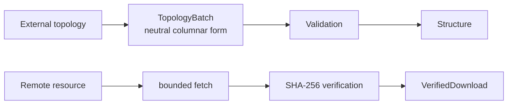

# molframe-adapters

Boundary adapters for external topology and verified remote data.

This crate handles integration problems that sit outside the scientific kernels: transferring topology across representation boundaries and acquiring external resources under explicit integrity constraints.

## Topology transfer

`TopologyBatch` is a compact, representation-neutral snapshot built from contiguous columns and batch-local string identifiers. It can be produced or consumed without requiring another library to adopt MolFrame's internal storage layout.

Import validates column lengths, hierarchy offsets, indices, elements, and connectivity before constructing an immutable native structure. Invalid external state is rejected rather than repaired implicitly.

## Resource acquisition

Network retrieval requires both a byte ceiling and an expected SHA-256 digest. Redirect behavior and timeouts are explicit, and bytes are published only after integrity verification succeeds.

The crate therefore acts as an integration boundary, not as another analysis layer.
