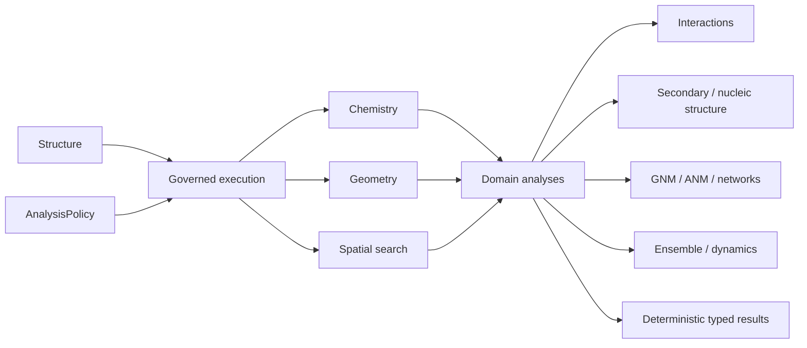

# molframe-analysis

Higher-level structural and biophysical analyses.

This crate sits above the shared geometry, chemistry, spatial, surface, and trajectory layers. It combines those lower-level primitives into analyses that have molecular meaning.

The crate includes hydrogen bonds, salt bridges, aromatic interactions, water-mediated contacts, residue contact maps, secondary structure, nucleic-acid geometry, membrane and pore analyses, spatial density, fragment mapping, and elastic-network models.

Neighbor-based algorithms use the shared spatial layer rather than independent all-pairs implementations. Chemistry-sensitive analyses consume explicit chemical annotations rather than rebuilding chemistry from atom names.

Network models share a common contact graph, while GNM and ANM apply different operators over that graph.

The governed layer connects raw kernels to MolFrame's policy, coverage, and provenance contracts.
