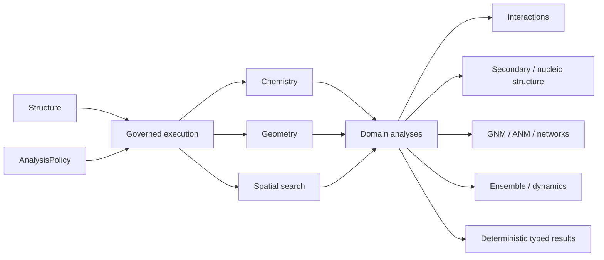

# molframe-analysis

Higher-level structural and biophysical analyses.

This crate sits above the shared geometry, chemistry, spatial, surface, and trajectory layers. It combines those lower-level primitives into analyses that have molecular meaning.

```mermaid
flowchart LR
    Structure["Structure"] --> Governed["Governed execution"]
    Policy["AnalysisPolicy"] --> Governed

    Governed --> Chem["Chemistry"]
    Governed --> Geom["Geometry"]
    Governed --> Spatial["Spatial search"]

    Chem --> Domains["Domain analyses"]
    Geom --> Domains
    Spatial --> Domains

    Domains --> Interactions["Interactions"]
    Domains --> Secondary["Secondary / nucleic structure"]
    Domains --> Networks["GNM / ANM / networks"]
    Domains --> Ensemble["Ensemble / dynamics"]
    Domains --> Result["Deterministic typed results"]
```

The crate includes hydrogen bonds, salt bridges, aromatic interactions, water-mediated contacts, residue contact maps, secondary structure, nucleic-acid geometry, membrane and pore analyses, spatial density, fragment mapping, and elastic-network models.

Neighbor-based algorithms use the shared spatial layer rather than independent all-pairs implementations. Chemistry-sensitive analyses consume explicit chemical annotations rather than rebuilding chemistry from atom names.

Network models share a common contact graph, while GNM and ANM apply different operators over that graph.

The governed layer connects raw kernels to MolFrame's policy, coverage, and provenance contracts.

## Screened contact potential

`contact_potential` evaluates caller-supplied atom-aligned charges on an affine
`GridSpec` (row-major matrix acting on column vectors; x-fastest storage).
Charges are in elementary-charge units and coordinates in ångström. Output is
in kT/e at 298 K. The distance-dependent dielectric is 4r; distances below
1 Å are clamped to 1 Å. The default finite cutoff is 12 Å, inclusive. This is
a local screened Coulomb contact field, **not Poisson–Boltzmann**.

The cell list borrows coordinates and prunes candidates; exact scientific
distances and cutoff decisions use f64. Fixed voxel blocks run on the shared
`ExecutionContext` worker pool with worker-count-independent output.
`MrcMapDescriptor::voxel_to_world()` can supply the same affine without
assuming an orthogonal unit cell. Python exposes `analysis.GridSpec`,
`analysis.ScalarGrid` and `analysis.contact_potential`.
