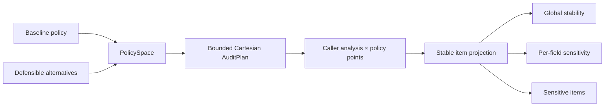

# molframe-audit

Bounded sensitivity analysis over scientific policy choices.

A scientific result may depend on choices such as alternate-conformation handling, model selection, identifier namespace, or missing-data policy. `molframe-audit` measures that dependence instead of treating one default as universally authoritative.

The audit crate does not reimplement any scientific analysis. The caller supplies:

1. the analysis to execute under each policy;
2. a projection from each result into stable item identities.

The planner computes the exact Cartesian cost before execution and refuses a policy space that exceeds the caller's run bound.

The report then identifies invariants, policy-sensitive items, and sensitivity attributable to each varied dimension. Batch auditing aggregates the same measurements across multiple structures.
