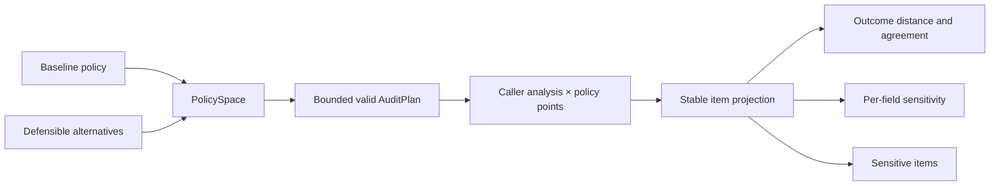

# molframe-audit

Bounded sensitivity analysis over scientific policy choices.

A scientific result may depend on choices such as alternate-conformation handling, model selection, identifier namespace, or missing-data policy. `molframe-audit` measures that dependence instead of treating one default as universally authoritative.

```mermaid
flowchart LR
    Baseline["Baseline policy"] --> Space["PolicySpace"]
    Alternatives["Defensible alternatives"] --> Space

    Space --> Plan["Bounded valid AuditPlan"]
    Plan --> Runs["Caller analysis × policy points"]
    Runs --> Project["Stable item projection"]

    Project --> Global["Outcome distance and agreement"]
    Project --> Dimension["Per-field sensitivity"]
    Project --> Items["Sensitive items"]
```

The audit crate does not reimplement any scientific analysis. The caller supplies:

1. the analysis to execute under each policy;
2. an outcome metric, with a projection into stable identities or numerical values.

The planner computes the Cartesian cost before execution and refuses a policy
space that exceeds the caller's run bound. A strict plan refuses contradictory
or explicitly forbidden pairs; a constrained plan drops those combinations and
records how many it omitted. Decisions carry a rationale, evidence and an
uncertainty class. This is not yet a dependency graph with applicability predicates.

`audit_analyses` verifies every run's declared policy reads and refuses a varied
field that run did not apply. Indeterminate runs are counted separately and
withhold the distance decomposition. The lower-level `audit_outcomes` accepts
arbitrary callback results and cannot verify their execution semantics.

Metrics cover sets, scalars, vectors, rankings, graphs and categorical conclusions.
Balanced factorial plans support descriptive main-effect and interaction
partitions; constrained plans need Shapley attribution instead. Non-Euclidean
distances need not yield non-negative additive shares. Shapley allocation is
conditional on uniform enumeration of the valid universes, and includes
dependence induced by constraints; it is not causal attribution.

Agreement with the first universe is conditional on the declared alternatives,
not a probability that a biological claim is correct. Neither the decomposition
nor batch aggregation performs a population-level significance test. Sets must
use stable input identities rather than indices in a filtered or replicated
system; governed results provide `atom_origin` for that mapping.

Certificates serialize provenance and descriptive findings as JSON-LD shaped
as RO-Crate 1.1. Input byte identity requires recorded SHA-256 digests; external
profile conformance has not been established.

Governed runs must also carry identical estimand declarations. Changing the
quantity midway through a sweep, dropping a declaration, or adding one only
later is refused before distances and attribution are computed. Entirely
undeclared legacy runs remain supported. Matching declarations are a consistency
check on supplied provenance; they do not prove biological equivalence of systems.
