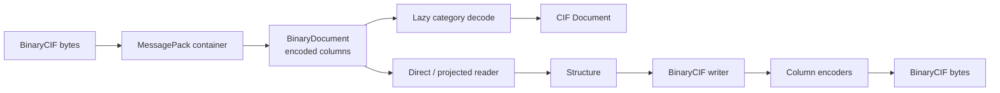

# molframe-bcif

BinaryCIF container, codecs, structural reader, and writer.

BinaryCIF stores CIF categories as MessagePack plus encoded columns. MolFrame preserves that layering instead of eagerly expanding the complete document.

`BinaryDocument` parses the container and encoding metadata while leaving individual columns encoded until requested. A caller can decode one category, materialize a full CIF document, or project directly into structural data.

The codec layer implements integer, floating-point, and string transformations independently from the structural reader. The writer performs the inverse transformation deterministically.

`molframe-bcif` builds on the CIF data model where the two formats share semantics, while retaining a BinaryCIF-specific path where materializing textual CIF concepts would be unnecessary.
