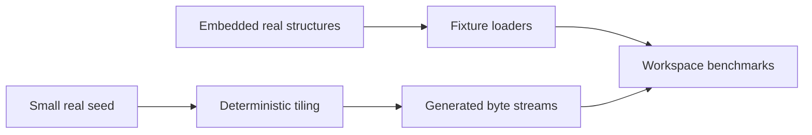

# molframe-bench

Shared benchmark fixtures and generators for the MolFrame workspace.

This internal crate keeps performance experiments reproducible without making every crate maintain its own fixture machinery.

Real samples provide common PDB, mmCIF, BinaryCIF, and chemistry fixtures.

For workloads larger than anything reasonable to commit to the repository, the synthetic layer tiles a real structure and can emit format text incrementally. Large-input benchmarks therefore do not require large repository assets or network downloads.

This crate is benchmark infrastructure and is not published as part of the public API.
