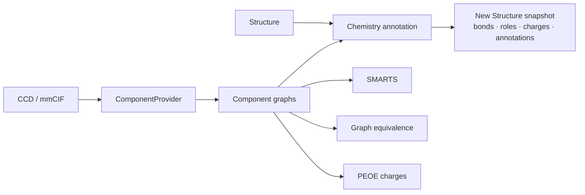

# molframe-chem

Chemical semantics and reference chemistry for MolFrame structures.

Geometry can say that two atoms are close; chemistry determines what those atoms are and what that proximity means. `molframe-chem` owns that chemical layer.

## Architecture

Chemical component definitions are independent of structure-local symbols. A `ComponentProvider` supplies versioned component graphs from memory or from a lowered Chemical Component Dictionary.

Applying component chemistry produces a **new immutable structure snapshot** with resolved internal connectivity, atom roles, component classifications, and optional checked polymer links. Existing file connectivity is not blindly replaced.

The same component graph powers:

- element and radius data;
- exact chemical-equivalence classes;
- SMARTS substructure matching;
- hydrogen-bond donor/acceptor roles;
- polymer atom roles and side-chain semantics;
- PEOE partial-charge calculation;
- MOL and MOL2 molecular I/O.

This keeps name-based heuristics out of geometry and analysis kernels.
