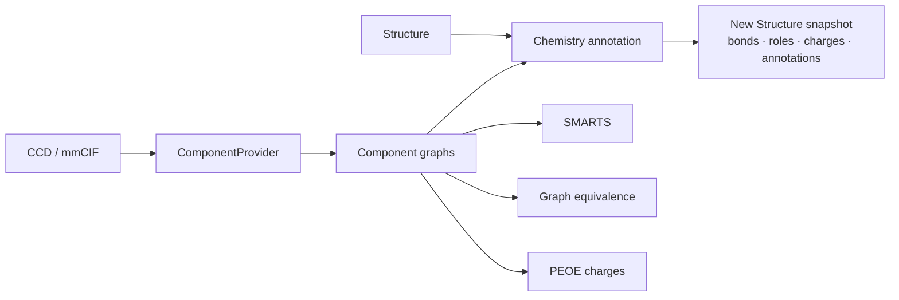

# molframe-chem

Chemical semantics and reference chemistry for MolFrame structures.

Geometry can say that two atoms are close; chemistry determines what those atoms are and what that proximity means. `molframe-chem` owns that chemical layer.


```mermaid
flowchart LR
    CCD["CCD / mmCIF"] --> Provider["ComponentProvider"]
    Provider --> Components["Component graphs"]

    Structure["Structure"] --> Annotate["Chemistry annotation"]
    Components --> Annotate
    Annotate --> Enriched["New Structure snapshot<br/>bonds · roles · charges · annotations"]

    Components --> SMARTS["SMARTS"]
    Components --> Eq["Graph equivalence"]
    Components --> PEOE["PEOE charges"]
```

## Architecture

Chemical component definitions are independent of structure-local symbols. A `ComponentProvider` supplies versioned component graphs from memory or from a lowered Chemical Component Dictionary.

Applying component chemistry produces a **new immutable structure snapshot** with resolved internal connectivity, atom roles, component classifications, and optional checked polymer links. Existing file connectivity is not blindly replaced.

The same component graph powers:

- element and radius data;
- exact chemical-equivalence classes;
- SMARTS substructure matching;
- hydrogen-bond donor/acceptor roles;
- polymer atom roles and side-chain semantics;
- PEOE partial-charge calculation;
- MOL and MOL2 molecular I/O.

This keeps name-based heuristics out of geometry and analysis kernels.

### Default bond perception

`perceive_bonds` preserves deposited edges before adding polymer attachments
and distance-inferred connectivity. `perceive_bonds_in` uses an explicit
execution context and produces the same edges, orders and provenance at every
worker budget. Its sorted-cell search caches element thresholds once per atom
and rejects candidates outside the shared distance window before resolving atom
handles; no per-candidate element-threshold lookup or metal classification is
needed. Storage remains O(N+B), with no per-atom neighbour vectors.

`covalent_pair` exposes the same distance window and alternate-conformer/H–H
eligibility for callers such as assembly connectivity. It excludes metal
coordination, which default perception can retain. Missing or unsupported
elements and nonfinite squared distances are rejected. Neither geometric path
replaces deposited connectivity or assigns bond orders from distance alone.

### Explicit Python polymer roles

`analysis.dssp` requires caller-selected CCD polymer roles, unlike automatic
file-read assignment. `chemistry.annotate` supplies chemical roles but does not
choose a polymer atom-name policy. Apply `chemistry.apply_polymer_role_profile`
with `PolymerRoleRule` entries and an explicit `profile_id` before analysis.
Rules carry native component-kind codes (amino acid = 1) and role bitsets
(protein N/CA/C/O = 1/2/4/8). The returned report retains dictionary/profile
identity and unresolved components; unmatched atoms remain unassigned.

```python
rules = [
    molframe.chemistry.PolymerRoleRule(name, 1 << bit, component_kind=1)
    for bit, name in enumerate(("N", "CA", "C", "O"))
]
roles = molframe.chemistry.apply_polymer_role_profile(
    structure, "CCD-amino-acids.cif", rules,
    profile_id="wwpdb-backbone-2026-10-03", version="wwPDB-2026-10-03",
)
states = molframe.analysis.dssp(roles.structure)
```

## Carbohydrate chemistry

`molframe::chemistry::carbohydrates` inventories O+4C/O+5C rings from existing
connectivity, optionally augmented with a versioned `ComponentProvider`. It does
not invent ring bonds from distances. Alternate conformers remain separate;
missing ring atoms are reported and nonfinite/degenerate geometry remains absent.
Symbols are curated from Mol* SNFG metadata, not inferred stereochemistry.

Declared glycosidic and terminal bonds retain provenance. The optional spatial
fallback only joins vacant anomeric carbons to sugar hydroxyl oxygen or known
ASN/SER/THR/TYR/CYS glycosylation sites, with known acceptor topology, between
1 and 2 Å. Occupied donors, saturated acceptors and competing sites are refused.
It is inference, not experimental evidence; the input structure is unchanged.
Without a provider, only the input bond graph is used.
The fallback switch disables only new spatial searches; existing valid
distance-inferred input bonds are retained as inference and are checked against
the same distance and vacancy constraints. Python `molframe.read` already
perceives connectivity, so its input can contain such inferred edges.

```python
import molframe

structure = molframe.read("1HZH.cif")
report = molframe.chemistry.carbohydrates(
    structure, "CCD-saccharides.cif", version="wwPDB-2026-10-02",
)
assert len(report.monosaccharides) == 18
assert len(report.links) == 16
assert len(report.terminal_links) == 0
```

The bundled CC0 1HZH/CCD fixtures support a raw-CIF differential: every reported
sugar and every donor/acceptor atom pair are checked against deposited branch
scheme/link categories; removing sugar links exercises the independent spatial
path. No glycan–protein attachment is declared in this deposition. The nearest
root NAG C1–ASN ND2 distances are 2.643 Å and 2.454 Å, outside the conservative
2 Å limit, so the report correctly leaves them unlinked rather than inferring
attachments from biological expectation. Run
`nix develop -c cargo test -p molframe-chem carbohydrates -- --nocapture`.

## Structure partial charges

`partial_charges(structure, provider, options)` returns one elementary-charge
value per observed atom, in unchanged atom order. A complete finite file
`charge` column wins and records `ChargeSource::File`; incomplete columns are
rejected rather than mixed with computed values. Otherwise the versioned CCD
graph is typed by the canonical Gasteiger–Marsili PEOE implementation and
joined through explicit inter-residue topology. Absent leaving atoms are
removed at linkage sites; missing CCD hydrogens participate and their charge
is projected onto their observed parent (a united-atom projection).

The result records the dictionary version and PEOE options. Unknown components,
unsupported elements, ambiguous conformers and absent heavy atoms are errors,
not zero-charge fallbacks. Choose protonation in the component provider; this
calculation does not infer pH. Python `chemistry.partial_charges` accepts an
explicit CCD path; without one, only file charges can resolve successfully.
