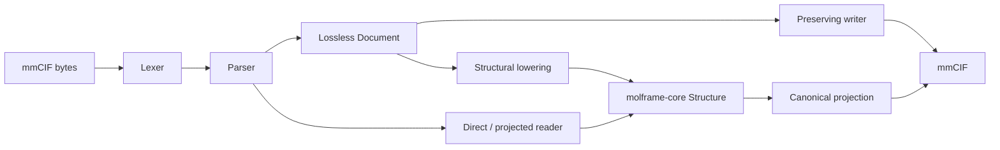

# molframe-cif

PDBx/mmCIF parsing, interpretation, and writing.

The central design decision in this crate is to keep **syntax** separate from **structural meaning**. A CIF document records what the file said; lowering determines what those categories mean as a molecular structure.

## Architecture

The crate provides two complementary read paths:

**Document path**  
Preserves ordering and categories, including information MolFrame does not interpret. This is appropriate for document tooling and loss-aware round trips.

**Structural path**  
Projects the categories required for molecular structure into the shared `Structure` representation. Direct and projected readers can avoid materializing an unnecessary complete document.

Interpretive decisions live in the lowering layer, where ambiguities can become diagnostics rather than parser guesses.

Writing follows the same separation: callers can preserve document-level information or construct a deterministic canonical structural projection.
