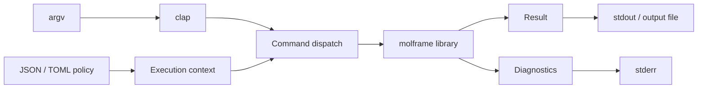

# molframe-cli

The command-line frontend for the MolFrame engine.

The CLI is an orchestration layer. Parsing arguments, loading configuration, dispatching commands, and rendering output live here; scientific implementations remain in the library crates.

The binary links the full MolFrame feature surface and routes commands into the same APIs available to Rust callers.

Primary results and diagnostic findings have separate output channels so shell pipelines are not contaminated by warnings.

The reporting layer supports human-readable output together with structured JSON, JSON Lines, CSV/TSV, Arrow IPC, and Parquet workflows where applicable.

If functionality is reusable outside the command line, it belongs in a library crate rather than here.
