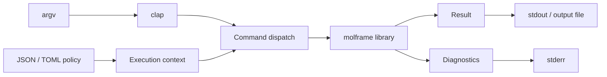

# molframe-cli

The command-line frontend for the MolFrame engine.

The CLI is an orchestration layer. Parsing arguments, loading configuration, dispatching commands, and rendering output live here; scientific implementations remain in the library crates.


```mermaid
flowchart LR
    Args["argv"] --> Parse["clap"]
    Config["JSON / TOML policy"] --> Context["Execution context"]
    Parse --> Dispatch["Command dispatch"]
    Context --> Dispatch

    Dispatch --> API["molframe library"]
    API --> Result["Result"]
    API --> Findings["Diagnostics"]

    Result --> Stdout["stdout / output file"]
    Findings --> Stderr["stderr"]
```

The binary links the full MolFrame feature surface and routes commands into the same APIs available to Rust callers.

Primary results and diagnostic findings have separate output channels so shell pipelines are not contaminated by warnings.

The reporting layer supports human-readable output together with structured JSON, JSON Lines, CSV/TSV, Arrow IPC, and Parquet workflows where applicable.

If functionality is reusable outside the command line, it belongs in a library crate rather than here.

## Explicit DSSP roles

`sse` requires `--role-profile roles.toml` (or `.json`) as well as an explicit
CCD path/version and all numerical options. Chemical-role annotation alone does
not define polymer backbone roles. The CLI loads the supplied profile and applies
the native CCD-aware role API; it never guesses a profile or standard atom names.

A profile contains `profile_id` and ordered `rules`. Every rule has `atom_name`,
integer `role` bits, and at least one constraint: an exact `component_id` or native
integer `component_kind` code (both may be supplied). Unknown fields, unsupported
codes, empty identifiers/rules/atom names, and zero role sets are rejected.
Unmatched atoms remain unassigned; unresolved CCD components are reported on stderr.

This caller-authored example defines the conventional N/CA/C/O heavy backbone
only for CCD amino acids (`component_kind = 1`). Save it as `roles.toml`:

```toml
profile_id = "wwpdb-amino-acid-backbone-2026-10-03"

[[rules]]
atom_name = "N"
component_kind = 1
role = 1

[[rules]]
atom_name = "CA"
component_kind = 1
role = 2

[[rules]]
atom_name = "C"
component_kind = 1
role = 4

[[rules]]
atom_name = "O"
component_kind = 1
role = 8
```

The equivalent JSON document uses `{"profile_id": "...", "rules": [...]}`.
Role codes are native `PolymerAtomRole` bitsets, checked rather than truncated;
component-kind codes are native `ComponentKind` values. The identifier should
include the version of the caller's naming policy, independently of the CCD version.

For real crambin, explicitly choose the native default numerical values:

```bash
molframe sse 1crn.cif --ccd CCD-amino-acids.cif --ccd-version wwPDB-2026-10-03 \
  --role-profile roles.toml --electrostatic-prefactor 27.888 \
  --hydrogen-bond-energy=-0.5 --amide-hydrogen-distance 1.0 \
  --minimum-sequence-separation 1 --helix-offset 4 --three-ten-offset 3 \
  --pi-offset 5 --turn-offsets 3 5 --bend-angle-degrees 70 --format csv
```

The repository CCD fixture contains complete entries for the 20 unmodified amino
acids, not the entire wwPDB dictionary. Supply a broader dictionary when the input
requires other components. Output retains the 11 distinct canonical states:
`unknown`, `coil`, `alpha-helix`, `3-10-helix`, `pi-helix`, `polyproline`,
`other-helix`, `beta-bridge`, `strand`, `turn`, and `bend`.

