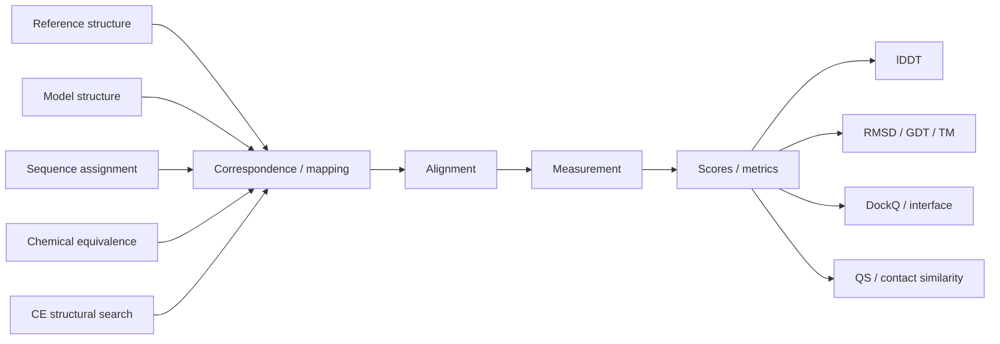

# molframe-compare

Structure correspondence, alignment, and comparison metrics.

Structural comparison is decomposed into stages so a score never silently decides how two structures correspond.

The workflow API makes **mapping → alignment → measurement → decision** explicit. This is especially important when several defensible atom or chain correspondences exist.

The crate combines several kinds of comparison:

- correspondence-free or superposition-free local metrics such as lDDT;
- rigid-fit metrics such as RMSD, GDT, and TM-style scores;
- sequence and chain assignment;
- chemistry-aware atom equivalence;
- Combinatorial Extension structural alignment;
- interface, contact-area, docking, and quaternary-structure scores.

Algorithms with potentially large search spaces expose explicit memory or search bounds rather than hiding unbounded allocation behind a convenience function.
