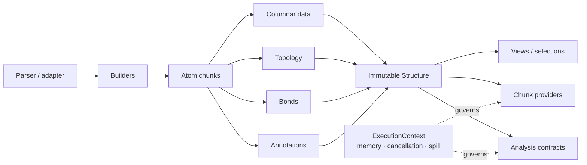

# molframe-core

The structural data model and execution contracts shared by the MolFrame workspace.

This crate defines what a molecular structure **is** inside MolFrame. Format readers, analyses, Python bindings, and exporters all meet at this layer instead of introducing their own representation.

## Storage model

Atoms are **columnar within a chunk and chunked across a structure**. A chunk is deliberately more than a storage container: it is also the unit of cache residency, parallel work, and summary statistics. This keeps working sets bounded as structures become large.

`Structure` is an immutable snapshot. Views retain the snapshot they were created from, and edits produce a new structure rather than invalidating previously exposed data.

## Contracts

Alongside coordinates and topology, `molframe-core` defines:

- typed atom, residue, chain, model, and entity indices;
- interned identifiers and compact optional columns;
- bonds and extensible annotations;
- diagnostics tied to source locations;
- selections and structure views;
- `AnalysisPolicy`, `Coverage`, `Status`, and `Provenance`;
- bounded execution, cancellation, memory accounting, scratch storage, and spill policy;
- out-of-core chunk-provider interfaces.

The crate contains no scientific analysis domain and no format-specific parser. It is the stable boundary they share.
