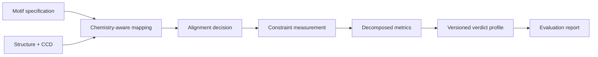

# molframe-fx

Declarative, chemistry-aware evaluation of functional molecular geometry.

`molframe-fx` models a functional motif as **components plus constraints**, then keeps chemical mapping, coordinate alignment, measurement, and pass/fail policy as separate stages.

A motif can describe polymer residues, ligands, cofactors, and metal centers together with required atoms and explicitly interchangeable atom groups.

Constraints include distances, angles, dihedrals, chirality, planarity, coordination, and minimum separation.

Mapping can use exact CCD graph-equivalence classes and preserves every defensible complete mapping instead of arbitrarily selecting one. Measurement similarly retains individual observables instead of collapsing them immediately into one score.

Versioned verdict profiles are a final independent layer, allowing external benchmark conventions to be reproduced without embedding their thresholds into the geometry engine.
