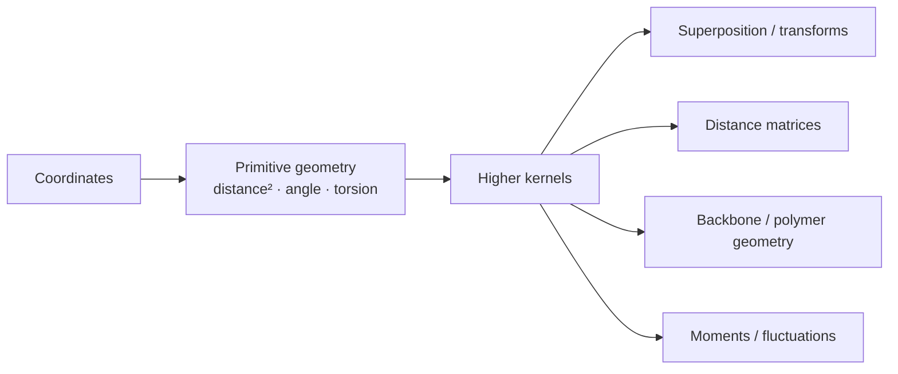

# molframe-geom

Low-level deterministic geometry for molecular computation.

`molframe-geom` intentionally knows nothing about residues, chains, chemistry, or file formats. It accepts coordinates and returns geometric quantities, making it reusable by every structural domain above it.

Squared distance is the fundamental distance primitive so cutoff-based algorithms can avoid unnecessary square roots.

Coordinates are stored as single precision elsewhere in MolFrame, but accumulations that grow with the number of terms use double precision. Measurement paths are designed to avoid heap allocation where practical.

The crate includes distances, angles, torsions, planar geometry, moments, rotations, rigid transforms, superposition, distance matrices, eigen-related utilities, and polymer geometry primitives.

Selection and chemical interpretation deliberately belong to higher layers.
