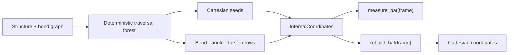

# molframe-ic

Internal-coordinate representation and deterministic Cartesian rebuilding.

This crate converts molecular geometry between Cartesian coordinates and a bond-angle-torsion representation while preserving enough Cartesian seeds to orient each disconnected component.

Shallow atoms and disconnected components remain Cartesian seeds. Deeper atoms are represented by references to three previously placed atoms plus bond length, bond angle, and torsion.

The topology of the internal-coordinate forest can be reused across trajectory frames, allowing new BAT values to be measured without repeating graph traversal.

Degenerate or missing geometry is reported rather than reconstructed from invented coordinates.
