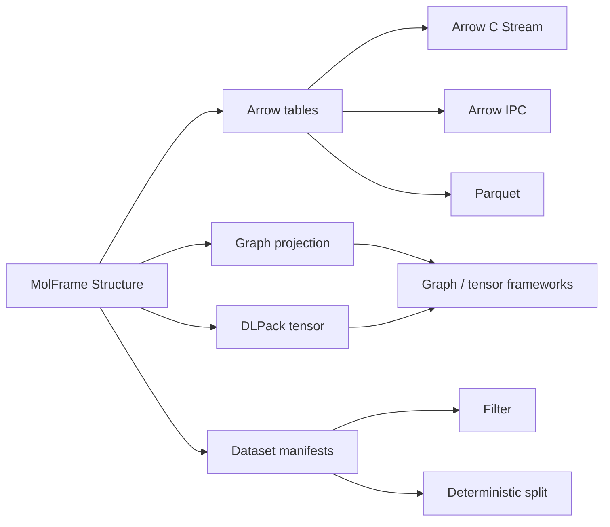
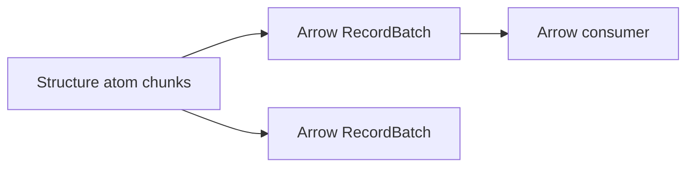
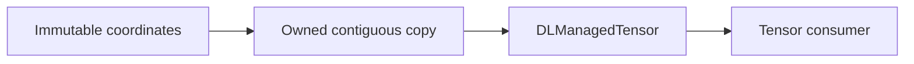
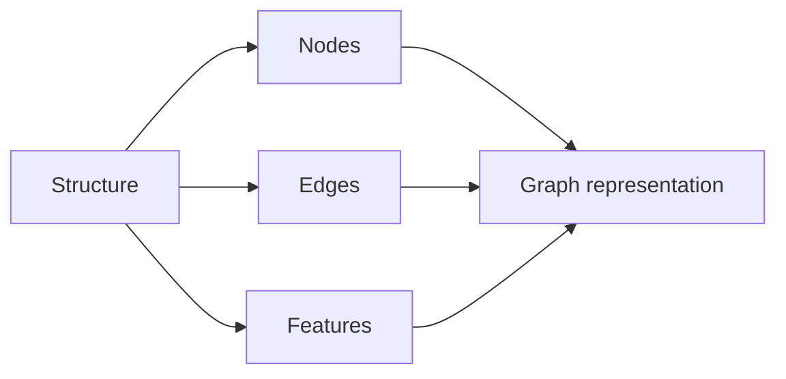
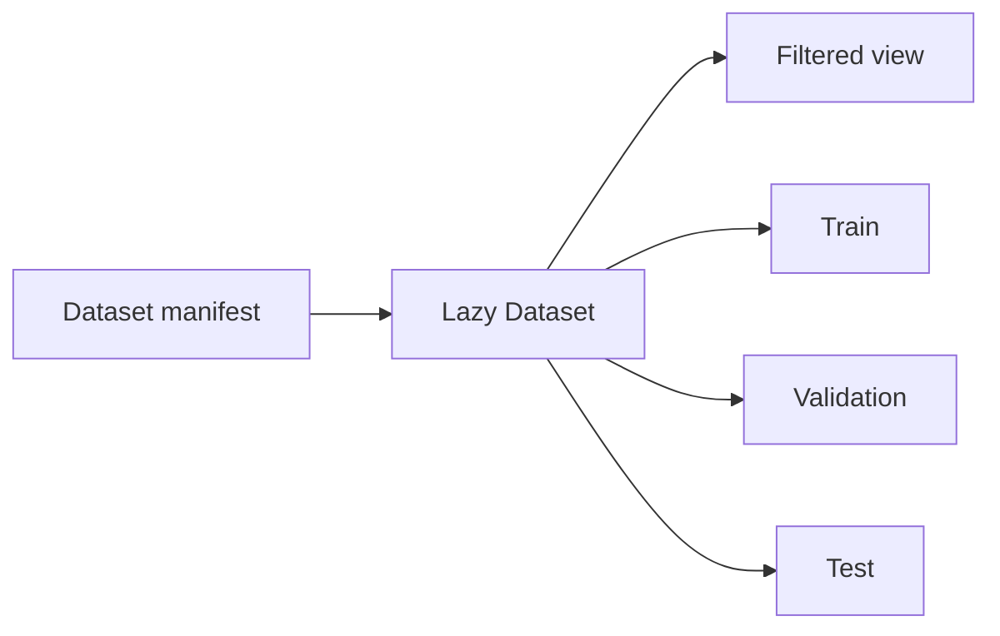

# molframe-interop

Zero-copy and structured interoperability for MolFrame data.

`molframe-interop` connects MolFrame's immutable structural model to external data ecosystems without introducing a second molecular representation.

It provides columnar tables, streaming interfaces, tensor exchange, graph projections, and dataset utilities built directly from `molframe-core::Structure`.

## Architecture

`Structure` remains the source of truth.

The crate does not copy structural semantics into framework-specific object models. Instead, it projects the same immutable snapshot into representations designed for analytics, tensor libraries, graph frameworks, or persistent columnar storage.

### Columnar interoperability

`AtomTable`, `ResidueTable`, `ChainTable`, and `BondTable` expose structural data through Apache Arrow.

Atom record batches follow MolFrame's internal chunk boundaries:

This allows consumers to process large structures incrementally rather than requiring one fully materialized table.

`ArrowStream` exposes the same model through the Arrow C Stream Interface and materializes at most one batch as the consumer pulls data.

Arrow-backed tables can also be written as:

- Arrow IPC
- Parquet

Schema metadata can retain MolFrame-specific information alongside the tabular representation.

## Tensor interoperability

Coordinate arrays can be exported through DLPack for tensor consumers.

Unlike Arrow, DLPack does not provide a read-only ownership contract: a consumer may legally mutate the tensor it receives. MolFrame structures are immutable snapshots, so exposing their coordinate storage directly would violate the structural model.

For that reason, DLPack export creates independently owned contiguous storage:

The copy is therefore an intentional ownership boundary rather than an implementation limitation.

## Graph projection

Molecular structures can be projected into deterministic graph representations suitable for graph-oriented consumers.

Graph construction derives nodes, edges, and features from the existing structural model instead of maintaining an independent graph-backed molecule representation.

This layer defines **data interchange**, not graph-learning algorithms.

## Dataset layer

Manifest-backed datasets provide lazy organization of collections of structures without loading the complete collection into memory.

Dataset utilities include filtering and deterministic splitting for reproducible downstream workflows.

Dataset management remains independent of any particular machine-learning framework.

## Boundary

This crate owns representations used to move MolFrame data across ecosystem boundaries.

It does **not** implement:

- machine-learning models;
- training or inference;
- tensor operations;
- graph neural networks;
- molecular structure storage;
- scientific analysis kernels.

Those consumers operate on data projected from the shared MolFrame `Structure`.
