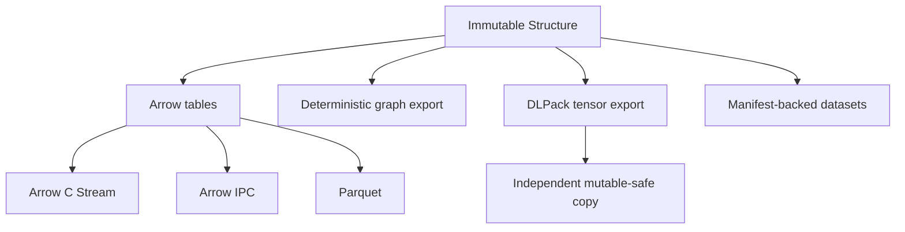

# molframe-ml

Interoperability between MolFrame structures and columnar, tensor, graph, and ML data pipelines.

This crate is an **export and dataset layer**, not a machine-learning framework. The molecular source of truth remains `Structure`.

Arrow atom batches follow MolFrame's internal chunk boundaries, which makes pull-based streaming possible without constructing the complete table first.

DLPack is handled differently. Because the protocol cannot promise read-only memory and consumers may legally mutate tensor data, coordinate export creates independent owned storage instead of exposing an immutable `Structure` snapshot as mutable memory.

The crate also provides deterministic graph construction and lazy dataset/split abstractions for ML workflows.

Raw ABI pointers are confined to the interoperability boundary rather than leaking into scientific kernels.
