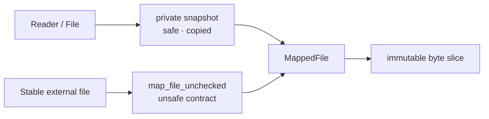

# molframe-mmap

The audited file-mapping boundary used by MolFrame.

Memory mapping has unusually strong lifetime requirements, so MolFrame keeps it isolated in a deliberately small crate rather than allowing operating-system mappings to leak into parsers and storage code.

## Safety model

The safe constructors create private read-only snapshots. Once created, external modifications cannot mutate or invalidate the bytes visible through `MappedFile`.

Direct zero-copy mapping is available separately and is explicitly unsafe: the caller must guarantee that no process or handle modifies, truncates, or invalidates the backing file for the lifetime of the mapping.

The crate also exposes sequential-access advice for large forward scans.

Keeping this boundary separate means the rest of MolFrame can consume immutable bytes without depending directly on `memmap2` or reproducing its safety contract.
