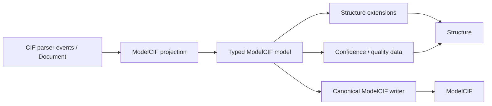

# molframe-modelcif

Typed ModelCIF metadata and confidence data over MolFrame's mmCIF infrastructure.

ModelCIF extends mmCIF with information about computational models, protocols, software, and quality estimates. This crate models those additions without creating a second structure representation or a second CIF parser.

The reader has an allocation-bounded direct projection path for data that does not require a complete intermediate document.

The model layer represents ModelCIF categories as typed Rust data, including confidence and quality information. Lowering attaches that information to the shared structural snapshot so predicted-model metadata remains associated with the coordinates it describes.

Writing reuses the common CIF infrastructure while emitting the ModelCIF-specific categories deterministically.
