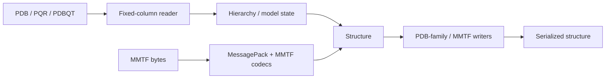

# molframe-pdb

Legacy PDB-family and MMTF structure I/O.

The PDB format is positional rather than delimiter-based: the meaning of a value depends on its exact columns. The reader therefore treats fixed-column interpretation, hierarchy reconstruction, and diagnostics as separate concerns.

## Design

Short records are handled according to fixed-column semantics rather than delimiter heuristics. Invalid fields become diagnostics instead of invented values, allowing a read to preserve both the usable structure and evidence of malformed input.

Residue identity includes chain, residue number, and insertion code, so identifiers such as `163`, `163A`, and `163B` remain distinct.

Writing is intentionally stricter than reading. When a structure cannot be represented inside the legacy field widths, the writer refuses the operation instead of silently truncating identifiers or coordinates.

The crate also contains MMTF schema, codec, lowering, and writing support as a binary legacy-structure path.
