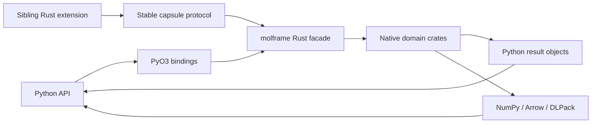

# molframe-py

The native Python binding layer for MolFrame.

`molframe-py` maps the Rust facade into Python without creating Python implementations of the scientific algorithms.

Registration is split by domain so the Python surface mirrors the Rust architecture rather than one monolithic extension module.

Native structures cross extension boundaries through an explicit capsule protocol. NumPy, Arrow, and DLPack adapters own the ABI and lifetime-sensitive code; computational kernels stay in Rust.

The crate links the full Rust facade and is built as the `_native` extension. It is implementation infrastructure for the Python package rather than a standalone Rust library.
