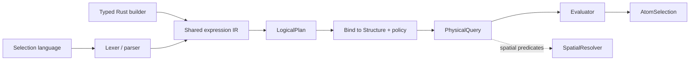

# molframe-query

A compiled structural selection engine with both textual and typed frontends.

Text queries and Rust builder expressions converge on the same intermediate representation, so the syntax used to construct a selection does not change its semantics.

Binding resolves structure-local symbols and folds constant branches once. The resulting physical plan can then be reused across repeated evaluations that share the same topology.

The planner can reorder conjunctions by estimated cost and resolves literal identifier membership without scanning the complete symbol dictionary.

Spatial predicates remain explicit dependencies: the query engine describes the geometric request while a spatial resolver performs the actual neighborhood search.

This makes selections reusable program objects rather than strings interpreted repeatedly at every call site.
