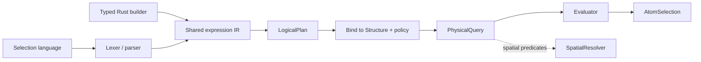

# molframe-query

The MolFrame selection language: a short text query such as
`byres (within 5 of resname HEM) and protein` that picks atoms out of a
structure. This page is the complete reference, for Python and Rust. Every
example here runs against haemoglobin, PDB [4HHB](https://www.rcsb.org/structure/4HHB).

- [Run a query](#run-a-query)
- [The language at a glance](#the-language-at-a-glance)
- [Keywords](#keywords): `protein`, `water`, `ligand`, …
- [Columns](#columns): `resname HEM`, `chain A B`, `resid 1:10`, `name C*`
- [Numeric comparisons](#numeric-comparisons): `bfactor > 50`
- [Combining: `and`, `or`, `not`](#combining-and-or-not)
- [Distance](#distance): `within 5 of …`, `around`, `sphzone`, …
- [Expanding a selection](#expanding-a-selection): `byres`, `same … as`, `bonded`
- [Named queries: `$name`](#named-queries-name)
- [Errors and warnings](#errors-and-warnings)
- [Keywords that need extra data](#keywords-that-need-extra-data)

## Run a query

### Python

```python
import molframe

structure = molframe.read("4hhb.cif")

heme = structure.select("resname HEM")   # a Selection
len(heme)                                # 172 atoms
heme.indices                             # numpy array of atom indices
heme.to_coordinates()                    # (172, 3) float32 array
```

Compile once when the same query runs many times; the compiled `Query` can be
combined with `&`, `|` and `~`:

```python
pocket = molframe.Query("byres (within 5 of resname HEM) and protein")
pocket.select(structure)
structure.select(pocket)                 # the same thing
```

Selections combine like sets: `a | b`, `a & b`, `a - b`.

To see *which residues* a selection touched, walk the hierarchy:

```python
def residues_in(structure, selection):
    """(chain, residue name) for every residue with a selected atom."""
    chosen = set(selection.indices.tolist())
    found = []
    for c in range(structure.chain_count):
        chain = structure.chains[c]
        for r in range(len(chain.residues)):
            residue = chain.residues[r]
            atoms = residue.atoms
            if any(atoms[a].index in chosen for a in range(len(atoms))):
                found.append((chain.label, residue.name))
    return found

residues_in(structure, structure.select("resname HEM"))
# [('A', 'HEM'), ('B', 'HEM'), ('C', 'HEM'), ('D', 'HEM')]
```

### Rust

```rust
use molframe::{AnalysisPolicy, Findings, Query, QueryStructure};

fn main() -> Result<(), Findings> {
    let structure = molframe::read("4hhb.cif")?;
    let query = Query::compile("byres (within 5 of resname HEM) and protein")?;
    let evaluation = structure.select_query(&query, &AnalysisPolicy::default())?;

    println!("{} atoms", evaluation.selection.len());
    for index in evaluation.selection.iter() {
        let Some(atom) = structure.atom_at(index as usize) else { continue };
        let residue = atom.residue().and_then(|residue| residue.auth_name());
        println!("{:?} {:?}", residue, atom.name());   // Some("MET") Some("N")
    }
    for warning in &evaluation.warnings {
        eprintln!("{warning}");
    }
    Ok(())
}
```

`select_text(source, &policy)` compiles and evaluates in one call. Findings
carry a byte span into the query; render them with the query quoted and
underlined:

```rust
let source = "name CA and bogus";
if let Err(findings) = Query::compile(source) {
    for finding in &findings {
        eprintln!("{}", molframe::Rendered::new(finding).with_source(source.as_bytes()));
    }
}
```

### In MolGFX

Every MolGFX target is a MolFrame query, used unchanged:
`show cartoon, protein`, `select pocket, byres (within 5 of $heme) and protein`.

## The language at a glance

| You want | Write |
|---|---|
| Everything / nothing | `all`, `none` |
| A kind of molecule | `protein`, `nucleic`, `water`, `ligand`, `polymer`, `hetero` |
| Residues by name | `resname HEM`, `resname HIS HEM` |
| A chain | `chain A`, `chain A B` |
| Residue numbers | `resid 87`, `resid 1:10`, `resid 1-10 20 30` |
| Atoms by name | `name CA`, `name N CA C O`, `name C*` |
| Elements | `element Fe`, `element C N` |
| A numeric condition | `bfactor > 50`, `occupancy < 1`, `50 < bfactor` |
| Both / either / not | `protein and chain A`, `water or ligand`, `not water` |
| Near something | `within 5 of resname HEM` |
| Whole residues | `byres (within 5 of resname HEM)` |
| A named query | `$pocket` |

Keywords are case-insensitive (`PROTEIN`, `Resname`). Values are case-sensitive
(`resname HEM`, not `hem`), except elements, which match in any case.

## Keywords

| Keyword | Selects |
|---|---|
| `all`, `none` | every atom, no atom |
| `protein` | amino-acid residues, or chains typed as protein |
| `nucleic` | nucleotides, or chains typed as nucleic acid |
| `polymer` | atoms of polymer chains |
| `water` | solvent |
| `ligand` | non-polymer, non-water residues (4HHB: the four haems and a phosphate) |
| `hetero` | atoms recorded as `HETATM` |
| `hydrogen`, `heavy` | hydrogen atoms, and every other atom |
| `aromatic` | atoms of aromatic bonds or annotations (needs extra data) |
| `backbone`, `sidechain` | protein backbone / side-chain atoms (needs extra data) |
| `nucleicbackbone`, `nucleicbase`, `nucleicsugar` | nucleic-acid parts (needs extra data) |
| `ion`, `lipid`, `saccharide` | chemical component classes (needs extra data) |

"Needs extra data" is explained [below](#keywords-that-need-extra-data); on a
plain mmCIF or PDB file, use the name-based form instead, for example
`protein and name N CA C O` for the backbone.

## Columns

A column name followed by one or more values selects atoms whose column holds
**any** of the values:

```text
resname HEM
resname HIS HEM          # HIS or HEM
chain A B
name N CA C O
```

| Column | Meaning |
|---|---|
| `name` | atom name (`CA`, `FE`) |
| `resname` | residue name (`HEM`, `HIS`) |
| `resid` | residue number |
| `chain` | chain identifier |
| `element` | element symbol, any case (`Fe`, `FE`, `fe`) |
| `altloc` | alternate location (`altloc A`, `altloc none` for atoms without one) |
| `icode` | insertion code |
| `entity`, `entity_type` | entity identifier and type |
| `segid` | segment identifier (PDB files) |
| `record_type` | `ATOM` or `HETATM` |
| `model` | model number |
| `index` | 0-based atom position; `bynum` is 1-based; `id` is the file's atom serial |
| `resindex`, `chainindex`, `modelindex` | 0-based positions of the residue, chain, model |
| `x`, `y`, `z` | coordinates, in ångström |
| `bfactor` (or `tempfactor`), `occupancy` | per-atom values from the file |
| `mass`, `radius`, `charge`, `formalcharge` | chemistry values |
| `plddt`, `pae` | model-confidence values (ModelCIF) |

**Author or label names.** mmCIF files carry two sets of names: the
depositor's (*author*) and the archive's (*label*). `name`, `resname`, `resid`
and `chain` use the author names, which are the ones papers and PDB files use.
Add a prefix to pick one explicitly: `label_chain A`, `auth_resid 87`,
`label_name CA`. In 4HHB, `chain A` has 1168 atoms (the protein, its haem and
its waters) while `label_chain A` has 1069 (the protein only), because the
archive gives each haem and water group its own label chain.

**Ranges.** Numeric columns take inclusive ranges written `1:10`, `1-10` or
`1to10`, mixed freely with single values: `resid 1:10 87 92`.

**Wildcards.** Text values take `*` (any run of characters), `?` (one
character) and `[...]` (one of a set): `name C*`, `name C?`, `name C[AB]`,
`resname H*`.

**Quoting.** Quote a value that contains a space or looks like a keyword:
`resname "A B"`, `name "and"`. A backslash escapes a single character.

## Numeric comparisons

Numeric columns take `<`, `<=`, `>`, `>=`, `==` and `!=`, with the column on
either side:

```text
bfactor > 50
50 < bfactor
bfactor >= 50 and bfactor <= 60
occupancy < 1
prop abs x < 5               # prop is optional; abs compares |value|
```

Comparing a measured value with `==` warns (`W4002`): a B-factor is rarely
exactly 20.0. Use a range instead: `bfactor 19.5:20.5`.

## Combining: `and`, `or`, `not`

`not` binds tightest, then `and`, then `or`, and parentheses group:

```text
protein and not water
protein and (chain A or chain C)
(chain A and resid 1:5) or resname HEM
```

Mixing `and` and `or` without parentheses warns (`W4001`), because it is
easy to misread: `protein and chain A or water` means
`(protein and chain A) or water` (1290 atoms in 4HHB), not
`protein and (chain A or water)` (1069).

`global` evaluates its target over the whole structure even inside a
narrowed selection: `global within 5 of resname HEM`.

## Distance

Distances are in ångström.

| Form | Selects |
|---|---|
| `within R of TARGET` | atoms within R of any target atom, **including** the target |
| `around R TARGET` | the same, **excluding** the target |
| `beyond R of TARGET` | atoms farther than R from every target atom |
| `sphzone R TARGET` | atoms within R of the target's centre |
| `sphlayer INNER OUTER TARGET` | a spherical shell around the target's centre |
| `isolayer INNER OUTER TARGET` | shells around each target atom |
| `cyzone R ZMAX ZMIN TARGET` | a cylinder along z around the target's centre |
| `cylayer INNER OUTER ZMAX ZMIN TARGET` | a cylindrical shell along z |
| `point X Y Z R` | atoms within R of a point |

```text
within 5 of resname HEM              # 535 atoms: the haems and their shell
around 5 resname HEM                 # 363 atoms: the shell only
within 5 of (resname HEM and chain A)
```

## Expanding a selection

| Form | Selects |
|---|---|
| `byres TARGET` | every atom of every residue that has a target atom |
| `same residue as TARGET` | the same, spelled out; also `chain`, `model`, `entity`, `fragment`, `segment` |
| `same COLUMN as TARGET` | atoms sharing a column value with the target: `same resname as resid 87` |
| `bonded TARGET`, `bonded N TARGET` | atoms up to N bonds from the target (default 1); needs bonds |

```text
byres (within 5 of resname HEM) and protein    # the haem pockets: 758 atoms
same chain as resname HEM
```

`byres within 5 of X` applies `byres` to `within 5 of X`; parenthesise when in
doubt.

## Named queries: `$name`

A query can refer to another by name with `$name` (or `group name`). Names
are defined with `QueryAliases`, and resolving a query substitutes every name,
so what runs is an ordinary query:

```python
aliases = molframe.QueryAliases()
aliases.define("heme", molframe.Query("resname HEM"))
aliases.define("pocket", molframe.Query("byres (within 5 of $heme) and protein"))

pocket = aliases.resolve(molframe.Query("$pocket"))
pocket.source              # the resolved text, with no names left
structure.select(pocket)
```

```rust
let mut aliases = molframe::QueryAliases::new();
aliases.define("heme", Query::compile("resname HEM")?)?;
let pocket = aliases.resolve(&Query::compile("within 5 of $heme")?)?;
structure.select_query(&pocket, &AnalysisPolicy::default())?;
```

Definitions are live: redefining `heme` changes what `$pocket` resolves to.
Resolving rejects an unknown name (`E4005`) and cycles (`E4006`). A name that
is never resolved selects nothing and warns (`W4003`).

In MolGFX, `select NAME, QUERY` defines `$NAME` for the session.

## Errors and warnings

A query that cannot run raises `molframe.QueryError` in Python (a
`ValueError`); in Rust it returns findings. The message quotes the query,
underlines the problem, and says what to do:

```text
error[MOLFRAME-E4004]: unknown selection keyword
  ┌─ 1:13
   │
 1 │ name CA and bogus
   │             ^^^^^
  = keyword: bogus
  = help: check the spelling against the keyword list; an annotation column can also be selected by its own name
```

A keyword the structure cannot answer says what it needs:

```text
error[MOLFRAME-E4003]: selection requires data this structure does not carry
  = required: CCD component annotations
  = help: provide the required annotations or choose a selector available for this structure
```

| Code | Means | Usually |
|---|---|---|
| `E4001` | the query is malformed | a missing value, operator or parenthesis |
| `E4002` | a value does not fit its column | a word where a number belongs: `bfactor > high` |
| `E4003` | the structure lacks data the keyword needs | see [below](#keywords-that-need-extra-data) |
| `E4004` | an unknown keyword | a typo: `resnam HEM` |
| `E4005` | an unknown `$name` | define it first |
| `E4006` | named queries refer to each other in a cycle | |
| `W4001` | `and` and `or` mixed without parentheses | add parentheses |
| `W4002` | `==` on a measured value | use a range |
| `W4003` | a value or name matches nothing here | check the spelling |

Warnings are `molframe.QueryWarning` in Python, a `UserWarning` that
`warnings.filterwarnings` can silence or turn into an error; in Rust they are
`Evaluation::warnings`.

## Keywords that need extra data

Some keywords rely on chemistry a file does not state; on a plain mmCIF or
PDB file they fail with `E4003` instead of guessing.

| Keyword | Needs | Without it, write |
|---|---|---|
| `backbone` | chemical component annotations | `protein and name N CA C O` |
| `sidechain` | chemical component annotations | `protein and not name N CA C O` |
| `ion`, `lipid`, `saccharide`, `nucleic*` | chemical component annotations | `resname ...` for the components you mean |
| `aromatic` | aromatic bonds or annotations | `resname PHE TYR TRP HIS` |
| `bonded` | bonds | infer them: `structure.infer_bonds()` |
| `chirality`, `smarts` | component annotations | |
| `atom SEG RESID NAME` | segment identifiers (PDB) | `chain A and resid 87 and name NE2` |

Component annotations come from the wwPDB Chemical Component Dictionary. In
Rust, apply one with `molframe::chemistry::apply_component_chemistry`; on the
command line, pass `--ccd components.cif`.

## How it works

Text queries and Rust builder expressions converge on one representation, so
how a selection is written never changes what it means.


```mermaid
flowchart LR
    Text["Selection language"] --> Parse["Lexer / parser"]
    Builder["Typed Rust builder"] --> IR["Shared expression IR"]
    Parse --> IR

    IR --> Logical["LogicalPlan"]
    Logical --> Bind["Bind to Structure + policy"]
    Bind --> Physical["PhysicalQuery"]
    Physical --> Eval["Evaluator"]

    Eval --> Selection["AtomSelection"]
    Physical -. spatial predicates .-> Spatial["SpatialResolver"]
```

Binding resolves structure-local symbols and folds constant branches once, and
the physical plan is reused across evaluations over the same topology. The
planner reorders conjunctions by estimated cost, and spatial predicates are
explicit dependencies that a spatial resolver answers.
