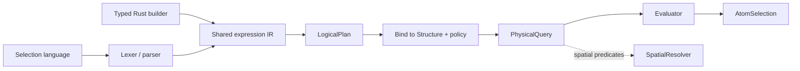

# molframe-query

The MolFrame selection language: a short text query such as
`byres (within 5 of resname HEM) and protein` that picks atoms out of a
structure. Every example here runs against haemoglobin, PDB [4HHB](https://www.rcsb.org/structure/4HHB).

The complete language -- every keyword, column, operator and distance form,
named queries, and what each error means -- is in the
**[query language reference](https://miguelcsx.github.io/molframe/docs/query-language/)**.

## Run a query

### Python

```python
import molframe

structure = molframe.read("4hhb.cif")

heme = structure.select("resname HEM")   # a Selection
len(heme)                                # 172 atoms
heme.indices                             # numpy array of atom indices
heme.to_coordinates()                    # (172, 3) float32 array
```

Compile once when the same query runs many times; the compiled `Query` can be
combined with `&`, `|` and `~`:

```python
pocket = molframe.Query("byres (within 5 of resname HEM) and protein")
pocket.select(structure)
structure.select(pocket)                 # the same thing
```

Selections combine like sets: `a | b`, `a & b`, `a - b`.

To see *which residues* a selection touched, walk the hierarchy:

```python
def residues_in(structure, selection):
    """(chain, residue name) for every residue with a selected atom."""
    chosen = set(selection.indices.tolist())
    found = []
    for c in range(structure.chain_count):
        chain = structure.chains[c]
        for r in range(len(chain.residues)):
            residue = chain.residues[r]
            atoms = residue.atoms
            if any(atoms[a].index in chosen for a in range(len(atoms))):
                found.append((chain.label, residue.name))
    return found

residues_in(structure, structure.select("resname HEM"))
# [('E', 'HEM'), ('G', 'HEM'), ('H', 'HEM'), ('J', 'HEM')]
```

`chain.label` is the archive's label chain; mmCIF gives each haem its own,
which is why these are not A to D.

### Rust

```rust
use molframe::{AnalysisPolicy, Findings, Query, QueryStructure};

fn main() -> Result<(), Findings> {
    let structure = molframe::read("4hhb.cif")?;
    let query = Query::compile("byres (within 5 of resname HEM) and protein")?;
    let evaluation = structure.select_query(&query, &AnalysisPolicy::default())?;

    println!("{} atoms", evaluation.selection.len());
    for index in evaluation.selection.iter() {
        let Some(atom) = structure.atom_at(index as usize) else { continue };
        let residue = atom.residue().and_then(|residue| residue.auth_name());
        println!("{:?} {:?}", residue, atom.name());   // Some("MET") Some("N")
    }
    for warning in &evaluation.warnings {
        eprintln!("{warning}");
    }
    Ok(())
}
```

`select_text(source, &policy)` compiles and evaluates in one call. Findings
carry a byte span into the query; render them with the query quoted and
underlined:

```rust
let source = "name CA and bogus";
if let Err(findings) = Query::compile(source) {
    for finding in &findings {
        eprintln!("{}", molframe::Rendered::new(finding).with_source(source.as_bytes()));
    }
}
```

### In MolGFX

Every MolGFX target is a MolFrame query, used unchanged:
`show cartoon, protein`, `select pocket, byres (within 5 of $heme) and protein`.

## The language at a glance

| You want | Write |
|---|---|
| Everything / nothing | `all`, `none` |
| A kind of molecule | `protein`, `nucleic`, `water`, `ligand`, `polymer`, `hetero` |
| Residues by name | `resname HEM`, `resname HIS HEM` |
| A chain | `chain A`, `chain A B` |
| Residue numbers | `resid 87`, `resid 1:10`, `resid 1-10 20 30` |
| Atoms by name | `name CA`, `name N CA C O`, `name C*` |
| Elements | `element Fe`, `element C N` |
| Hydrogen display classes | `polar_hydrogen`, `nonpolar_hydrogen` |
| A numeric condition | `bfactor > 50`, `occupancy < 1`, `50 < bfactor` |
| Both / either / not | `protein and chain A`, `water or ligand`, `not water` |
| Near something | `within 5 of resname HEM` |
| Whole residues | `byres (within 5 of resname HEM)` |
| A named query | `$pocket` |

Keywords are case-insensitive (`PROTEIN`, `Resname`). Values are case-sensitive
(`resname HEM`, not `hem`), except elements, which match in any case.

Everything else -- the full keyword and column tables, ranges, wildcards,
distance forms, `byres` and `same ... as`, named queries, errors and warnings,
and keywords that need extra data -- is in the
[query language reference](https://miguelcsx.github.io/molframe/docs/query-language/).

Hydrogen polarity reads the full bond topology: any N/O/S neighbour makes an
explicit hydrogen polar, even after a hydrogen-only filter. All other hydrogen
is nonpolar, including unbonded H. A known-empty graph is valid; unavailable
connectivity raises `MOLFRAME-E4003` rather than guessing from coordinates.
Use `molframe.sel.polar_hydrogen()` / `nonpolar_hydrogen()` in Python or
`molframe::query::col::polar_hydrogen()` / `nonpolar_hydrogen()` in Rust.

## How it works

Text queries and Rust builder expressions converge on one representation, so
how a selection is written never changes what it means.


```mermaid
flowchart LR
    Text["Selection language"] --> Parse["Lexer / parser"]
    Builder["Typed Rust builder"] --> IR["Shared expression IR"]
    Parse --> IR

    IR --> Logical["LogicalPlan"]
    Logical --> Bind["Bind to Structure + policy"]
    Bind --> Physical["PhysicalQuery"]
    Physical --> Eval["Evaluator"]

    Eval --> Selection["AtomSelection"]
    Physical -. spatial predicates .-> Spatial["SpatialResolver"]
```

Binding resolves structure-local symbols and folds constant branches once, and
the physical plan is reused across evaluations over the same topology. The
planner reorders conjunctions by estimated cost, and spatial predicates are
explicit dependencies that a spatial resolver answers.
