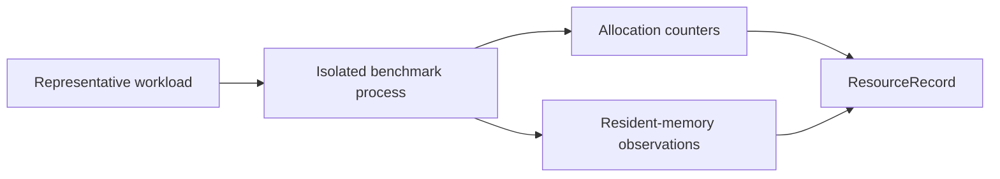

# molframe-resource-bench

Process-isolated resource measurements for MolFrame.

Criterion-style timing answers how fast an operation is. This crate answers a different question: **how much memory does it allocate and retain as the workload grows?**

The executable contains deterministic probes for parsing, generated structures, BinaryCIF, ModelCIF, MRC maps, XTC trajectories, Arrow interoperability, and scientific kernels.

Large generated-input cases are designed specifically to distinguish memory proportional to **input size** from memory proportional to an explicit **working-memory budget**.

Keeping these measurements outside the regular benchmark crate avoids confusing latency regressions with allocation or residency regressions.

This crate is internal and is not published.
