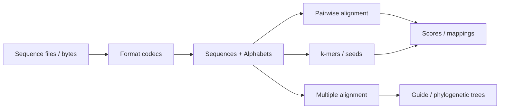

# molframe-seq

Sequence algorithms, alignment, biological sequence formats, and trees.

The crate is intentionally independent from the 3D structural model: sequence computation can be used on its own and is consumed by higher layers such as structural correspondence.

Pairwise alignment supports global, local, semi-global, banded, region, and substitution-matrix scoring with affine gaps.

The MSA layer builds on the same scoring primitives rather than maintaining an unrelated alignment model. k-mer, seed-and-extend, neighbor-joining, UPGMA, and Newick tree utilities cover the surrounding sequence workflow.

Supported text formats include FASTA, FASTQ, A2M, A3M, Clustal, PHYLIP, and Stockholm-family representations.

Tie breaking is explicit and deterministic, so equivalent optimal paths do not make repeated runs return different alignments.
