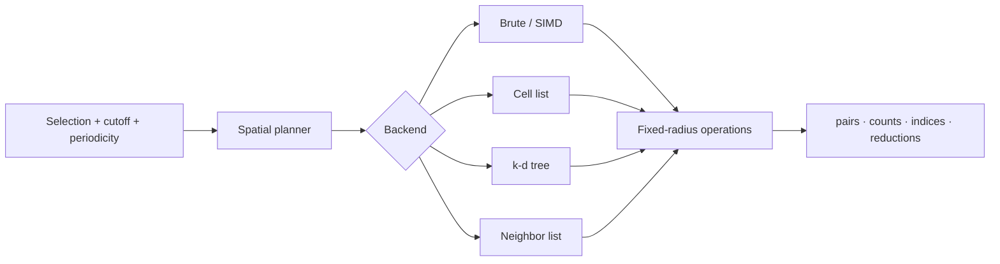

# molframe-spatial

Spatial planning, indexing, and fixed-radius queries.

Rather than exposing one mandatory spatial data structure, `molframe-spatial` separates **what a query needs** from **which backend should answer it**.

`StructureSpatial` binds spatial execution to one immutable structure snapshot. Compatible indexes can be retained and reused, while cache state remains bounded so query-controlled workloads cannot grow memory indefinitely.

Periodic geometry is explicit through `PeriodicBox` rather than being inferred by individual analyses.

Higher-level domains such as interactions, surfaces, validation, trajectories, and structural comparison reuse this layer instead of implementing independent all-pairs searches.
