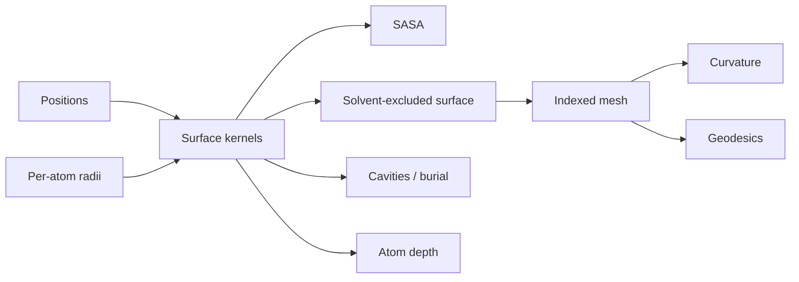

# molframe-surface

Molecular surface construction and intrinsic surface analysis.

The surface layer accepts **positions plus radii**. It does not decide what an element is or which radius convention is scientifically appropriate; those decisions belong to chemistry and policy layers above it.

SASA uses reusable deterministic sampling plans and the shared spatial infrastructure. SES construction uses a bounded probe-accessibility grid and produces contact and re-entrant regions of the rolling-probe surface.

Higher-level operations include buried surface, cavities, connected components, atom depth, mesh export, curvature, and surface geodesics.

Grid-based operations expose resource controls, and the governed workflow records the selection, radii set, probe, and numerical choices alongside the result.
