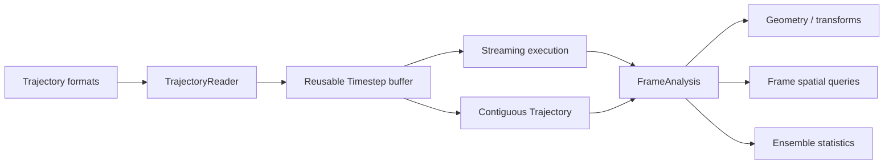

# molframe-traj

Trajectory formats, frame execution, and ensemble analysis.

The central abstraction is deliberately simple: a trajectory is a sequence of coordinate frames over a fixed atom ordering. **Topology is not duplicated inside the trajectory representation.**

A materialized `Trajectory` stores coordinates in one contiguous `(frames, atoms, 3)` allocation, giving constant-time borrowed frame access. Large datasets can instead remain behind `TrajectoryReader`, which fills a reusable caller-owned timestep buffer.

Format readers normalize positions, time, forces, and unit-cell data at the boundary.

The execution layer divides analyses into fixed canonical frame blocks. Worker count changes where blocks run, but not their reduction order, preserving deterministic numerical results across parallel configurations.

The crate includes common molecular-dynamics trajectory and topology formats together with clustering, PCA/diffusion-style analyses, similarity, solvent dynamics, periodic transforms, streaming contacts, RMSD, and RMSF.
