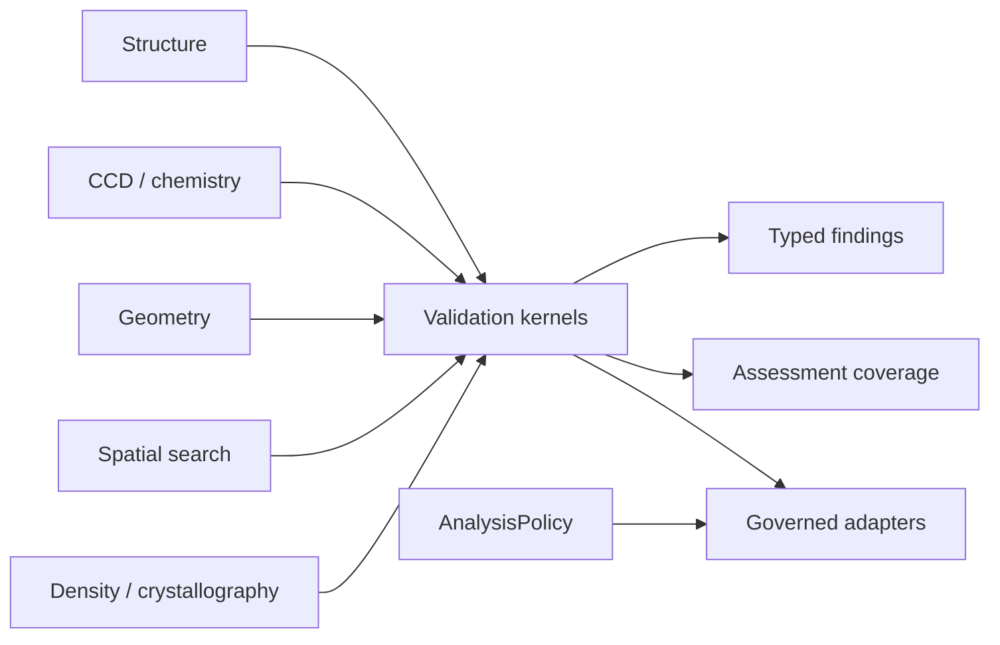

# molframe-validate

Actionable structural validation over the shared MolFrame model.

Validation results identify the atoms, residues, or geometric features responsible for a problem instead of reducing the structure to a single quality count.

The crate covers steric clashes, bond geometry, stereochemistry, planarity, backbone and side-chain conformations, peptide geometry, occupancy, completeness, ligand geometry, nucleic-acid geometry, thermal motion, and map-based validation.

Reference-sensitive checks consume explicit CCD targets rather than hard-coded residue-name tables. Spatial checks reuse the common neighbor-search layer, and crystallographic checks consume the same map and symmetry representations used elsewhere in MolFrame.

Results are deterministically ordered so the same structure and policy produce stable, diffable validation output.
