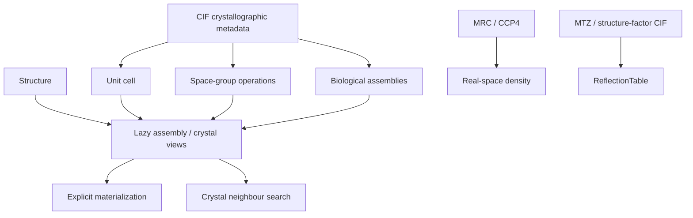

# molframe-xtal

Crystallographic symmetry, assemblies, maps, and reflection data.

The crate has two related responsibilities: interpreting coordinates in crystallographic context and representing the experimental reciprocal/real-space data associated with those structures.

Symmetry operations are parsed into exact fractional-coordinate transforms before being applied in Cartesian space. Biological assemblies remain as definitions and lazy instances until explicit materialization is requested.

Crystal-neighbor enumeration uses bounded generation and the shared spatial layer rather than constructing an unbounded expanded crystal.

The experimental-data side provides MRC/CCP4 scalar maps, coordinate-space sampling, MTZ and structure-factor tables, map statistics, and crystallographic restraints.

This keeps crystallographic context attached to the same structural representation used by the rest of MolFrame.
