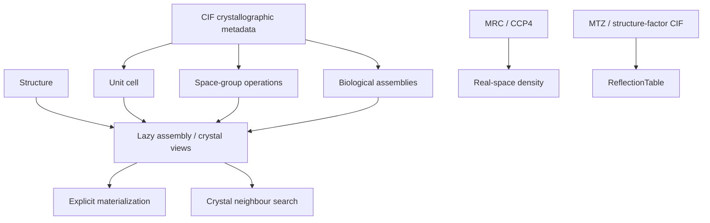

# molframe-xtal

Crystallographic symmetry, assemblies, maps, and reflection data.

The crate has two related responsibilities: interpreting coordinates in crystallographic context and representing the experimental reciprocal/real-space data associated with those structures.

```mermaid
flowchart TD
    CIF["CIF crystallographic metadata"] --> Cell["Unit cell"]
    CIF --> Symmetry["Space-group operations"]
    CIF --> Assemblies["Biological assemblies"]

    Structure["Structure"] --> Views["Lazy assembly / crystal views"]
    Cell --> Views
    Symmetry --> Views
    Assemblies --> Views

    Views --> Materialize["Explicit materialization"]
    Views --> Neighbors["Crystal neighbour search"]

    Maps["MRC / CCP4"] --> Real["Real-space density"]
    Refl["MTZ / structure-factor CIF"] --> Reciprocal["ReflectionTable"]
```

Symmetry operations are parsed into exact fractional-coordinate transforms before being applied in Cartesian space. Biological assemblies remain as definitions and lazy instances until explicit materialization is requested.

Crystal-neighbor enumeration uses bounded generation and the shared spatial layer rather than constructing an unbounded expanded crystal.

The experimental-data side provides MRC/CCP4 scalar maps, coordinate-space sampling, MTZ and structure-factor tables, map statistics, and crystallographic restraints.

`MrcMapDescriptor::voxel_to_world()` and `DensityMap::voxel_to_world()` return
row-major homogeneous matrices mapping local canonical XYZ voxel coordinates
to Cartesian ångströms. They use the triclinic cell transform and sampling
counts; a nonzero explicit MRC origin replaces the start-index translation,
matching Cartesian sampling. File axis permutations are already canonicalised
by the reader. Caller-created invalid geometry returns `MrcError::InvalidHeader`.

`AssemblyView::covalent_links(model, context)` reports geometrically plausible
links between distinct stable chain instances through the same chemistry
predicate used by default bond perception. Metal coordination, H–H pairs,
incompatible alternate conformers and same-instance pairs are excluded.
Distance alone establishes a single bond, not a deposited bond order. The
source topology and coordinate columns remain unchanged; transformed search
coordinates are temporary. Python exposes `crystal.assembly_covalent_links`.

This keeps crystallographic context attached to the same structural representation used by the rest of MolFrame.
