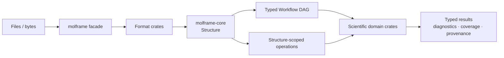

# molframe

The high-level Rust API for MolFrame.

`molframe` is the composition layer of the workspace. It does not implement scientific kernels itself; it connects the shared structural model in `molframe-core` with format readers, query and geometry primitives, and opt-in analysis domains behind one coherent API.

## Architecture

The crate has three main responsibilities:

- **I/O dispatch** selects a linked format implementation and normalizes the result into the shared `Structure`.
- **Composition** exposes a curated API over otherwise independent workspace crates.
- **Execution** provides typed `Node<T>` expression graphs compiled once into reusable `CompiledWorkflow` plans. Compilation validates types and cycles, removes dead/common work, plans lifetimes, and estimates memory before deterministic execution.

The root namespace is intentionally curated around structure handles, I/O,
policy, diagnostics, execution context, and workflow types. Algorithms live in
the canonical `geometry`, `analysis`, `surface`, `trajectory`, `validation`,
`compare`, and other domain namespaces.

Features control how much of the engine is linked. The default build contains the core model plus mmCIF and PDB support; geometry, chemistry, analysis, trajectories, ML interoperability, and other domains are opt-in.

Use `molframe` for applications that want the complete public API. Depend on individual `molframe-*` crates when building lower-level integrations or when minimizing the dependency surface matters.
