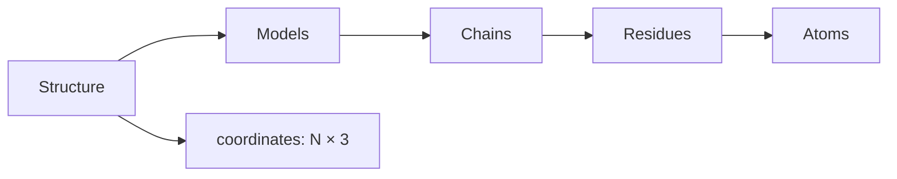

## Reading

Use `molframe.read()` with a path, bytes, or a `Reader`. Format detection uses the supplied name or path extension when available.

```python
import molframe

structure = molframe.read("model.cif")
# The same API reads a PDB file:
structure = molframe.read("model.pdb")
```

The default Python build includes PDB and mmCIF support.

## The hierarchy



The collections are indexable and report their length. Individual handles expose identifiers and their immediate children.

```python
structure = molframe.read("model.pdb")

print(structure.atom_count)
print(structure.residue_count)
print(structure.chain_count)
print(structure.model_count)

first_chain = structure.chains[0]
first_residue = first_chain.residues[0]
first_atom = first_residue.atoms[0]
print(first_atom.name, first_atom.element, first_atom.coordinate)
```

An atom coordinate can be `None` when the input does not provide coordinates for that atom. Do not assume every topology atom has a position.

## Coordinates

`structure.coordinates` is a NumPy-compatible `float32` array with one row per atom and three Cartesian coordinates per row. Coordinates are in Ångström. Keep the structure alive while using a coordinate view.

```python
coordinates = structure.coordinates
assert coordinates.shape == (structure.atom_count, 3)
```

For an analysis over a subset, use `selection.to_coordinates()` rather than manually aligning hierarchy indices.

## Ambiguity in input

PDB and mmCIF files can contain multiple models, alternate locations, missing coordinates, or ambiguous residue boundaries. MolFrame records input findings as diagnostics. Choose an explicit parsing policy when your scientific interpretation depends on these cases; do not silently merge conformers or models.
